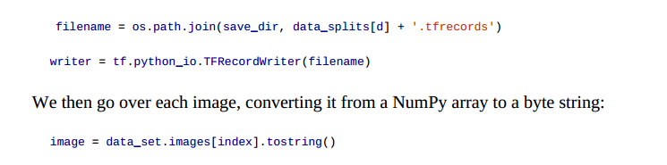

## TensorFlow的tfrecords文件详解

* 当前是数据爆炸的时代，深度学习与大数据更是相辅相成，在使用TensorFlow构建深度学习模型的时候，可能会涉及到海量的数据，可能会用到数G、T甚至P级别的训练数据，很显然，要将如此庞大的数据一次性加载进内存，显然当前的硬件条件还远远不能够。幸好TensorFlow也提供了非常有好的大数据处理方式。


*  A TFRecord file is simply a binary file, containing serialized input data. 
* 序列化基于protobufs，通过使用描述数据结构的模式，以纯文字的形式转换数据以进行存储，而与正在使用的平台或语言无关（很像XML）。
* Writing with TFRecordWriter
```
data_splits = ["train", "test", "validation"]
for d in range(len(data_splits)):
    print("saving " + data_splits[d])
    data_set = data_sets[d]
    filename = os.path.join(save_dir, data_splits[d] + '.tfrecords')
    writer = tf.python_io.TFRecordWriter(filename)

    for index in range(data_set.images.shape[0]):
        image = data_set.images[index].tostring()
        example = tf.train.Example(features=tf.train.Features(feature={
            'height': tf.train.Feature(int64_list=tf.train.Int64List(value=[data_set.images.shape[1]])),
            'width': tf.train.Feature(int64_list=tf.train.Int64List(value=[data_set.images.shape[2]])),
            'depth': tf.train.Feature(int64_list=tf.train.Int64List(value=[data_set.images.shape[3]])),
            'label': tf.train.Feature(int64_list=tf.train.Int64List(value=[int(data_set.labels[index])])),
            'image_raw': tf.train.Feature(bytes_list=tf.train.BytesList(value=[image]))
        }))
        writer.write(example.SerializeToString())
    writer.close()
```



