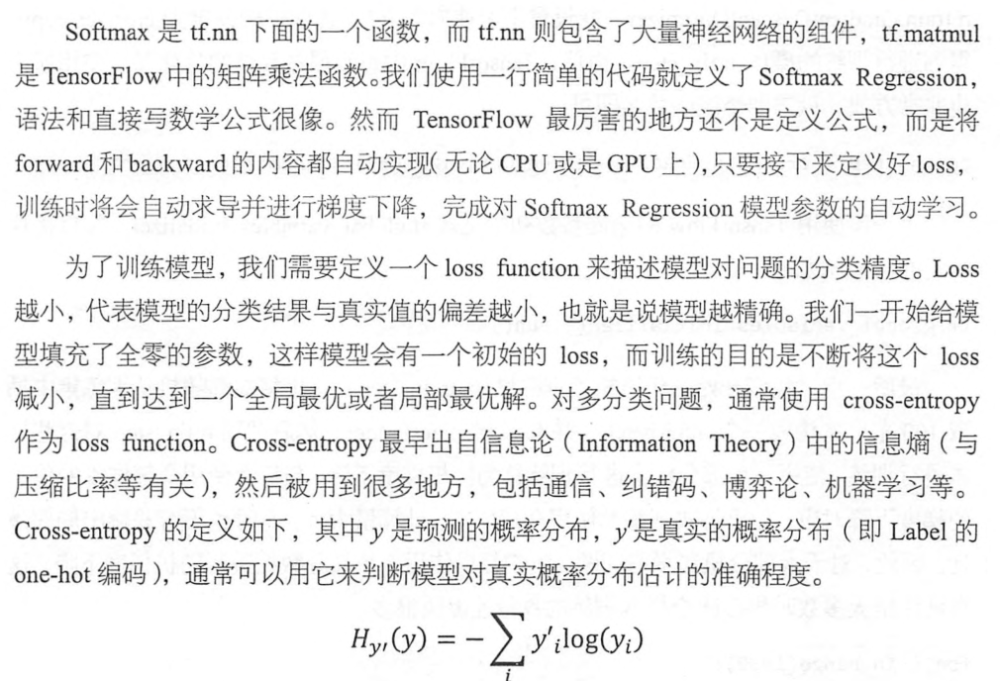

## 基本概念

### 1. 核心概念

* tensorflow中的计算可以表示为一个有向图，或者计算图，其中每一个运算操作将作为一个节点，节点与节点之间的链接表示为边。
这个计算图描述了数据的计算流程，它也负责维护和更新状态，用户可以对计算图的分支进行条件控制或循环操作。
* 计算图中每个节点可以有任意多个输入和任意多个输出，每一个节点描述了一种运算操作符，节点可以算是运算操作的实例化。
* 在计算图的边中流动的数据别称为张量

* 一个运算操作代表了一种类型的抽象运算，比如矩阵乘法或者向量加法。运算操作可以有自己的属性，但是所有的属性必须被预先设置，
或者能在创建计算图时被推断出来。

* session是用户使用Tensorflow时的交互式接口。用户可以通过Session的Extend的方法添加新的节点和边，用于创建计算图。然后通过
session 的Run方法执行计算图。用户给出需要计算的节点，同时提供计算数据，TensorFlow就会自动寻找所有需要计算的节点并按照
依赖顺序执行它们。

#### 2. 反向传播

#### 3. tensorflow 执行子图
* tensorflow 支持单独执行子图，用户可以选择计算图的任意子图，并沿某些边输入数据，同时从另一些边获取输出结果，

#### 4. tensorboard

## TensorFlow helloWord 示例

* [code](03.intro_tensorflow/tensorflow_手写体识别.py)

### TensorFlow helloWord 自编码

* [AutoEncoder GitHub](https://github.com/jiye-ML/AutoEncoder.git)

### TensorFlow 实现卷积网络

* [Github_04_cnn](https://github.com/jiye-ML/CNN)

--------

## 杂谈

* tensorflow优化的是训练参数变化，然后最小化损失函数，也就是损失函数对优化的参数求导，然后按照梯度下降方向走
* TensorFlow会将变量加入到训练变量中，Variable个就是一个标识，然后placehold标识为填充变量，

