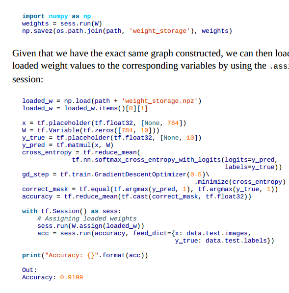

## 基本概念

### 1. 核心概念

* tensorflow中的计算可以表示为一个有向图，或者计算图，其中每一个运算操作将作为一个节点，节点与节点之间的链接表示为边。
这个计算图描述了数据的计算流程，它也负责维护和更新状态，用户可以对计算图的分支进行条件控制或循环操作。
* 计算图中每个节点可以有任意多个输入和任意多个输出，每一个节点描述了一种运算操作符，节点可以算是运算操作的实例化。
* 在计算图的边中流动的数据别称为张量


* 一个运算操作代表了一种类型的抽象运算，比如矩阵乘法或者向量加法。运算操作可以有自己的属性，但是所有的属性必须被预先设置，
或者能在创建计算图时被推断出来。


* session是用户使用Tensorflow时的交互式接口。用户可以通过Session的Extend的方法添加新的节点和边，用于创建计算图。然后通过
session 的Run方法执行计算图。用户给出需要计算的节点，同时提供计算数据，TensorFlow就会自动寻找所有需要计算的节点并按照
依赖顺序执行它们。

#### 2. 反向传播


#### 3. tensorflow 执行子图
* tensorflow 支持单独执行子图，用户可以选择计算图的任意子图，并沿某些边输入数据，同时从另一些边获取输出结果，


#### 4. tensorboard


---


## tensor and flow

### 1 . tensor

* tensor 三要素
    * name
    * dtype
    * shape
* 可以利用 tf.cast转换类型
```
x = tf.constant([1,2,3],name='x',dtype=tf.float32)
print(x.dtype)
x = tf.cast(x,tf.int64)
print(x.dtype)
Out:
<dtype: 'float32'>
<dtype: 'int64'>
```
* 利用 get_shape() 可以获得tensor的shape
* 可以利用初始化器初始化


* 初始化方法


####  Variables, Placeholders, and Simple Optimization

* 优化的过程要求变量可以在图中持续保存，并且更新。而Tensor的状态是“refilled” 在每一次运行session的时候。
variable的不是这种方式，它可以持续保存固定的状态在图中，
* 两步设置 variable 
    1. 调用  `tf.Variable()`并且传入初始化函数。
    2. 运行 `tf.global_variables_initializer()`显式初始化
* 上面这种方式初始化，每次运行run的时候都会重新生成一个新的变量 `get_variable`更节省资源。
* 利用 `ph = tf.placeholder(tf.float32,shape=(None,10))`定义需要输入的数据，然后在session.run的时候feeddict
```
sess.run(s,feed_dict={x: X_data,w: w_data})
```


### 2. flow


* 矩阵相乘 `tf.matmul(A,B)`
* 也可以通过 `tf.expand_dims()`扩展tensor的尺寸
* 可以利用 `with tf.name_scope("prefix_name"):`来给tensor定义name作用域。

---


## session

* A Session object is the part of the TensorFlow API that communicates between Python objects and data on our end, 
and the actual computational system where memory is allocated for the objects we define, intermediate variables are stored,
and finally results are fetched for us.

* TensorFlow： 基于数据流图的数值计算的框架


* tensorflow 做lazy evaluation
    * write the DAG
    * run the DAG in session
* 也可以是 eager模式
```
import tensorflow as tf
from tensorflow.contrib.eager.python import tfe

tfe.enable_eager_execution()

x = tf.constant([1, 2, 3])
y = tf.constant([1, 2, 3])
print(x + y)
```
* 保存图


* 查看图


### 1. Constructing and Managing Our Graph

* tensorflow会自己构建一张图
* tf.Graph() 可以构建一张新图。
```
import tensorflow as tf
print(tf.get_default_graph())
g = tf.Graph()
print(g)
Out:
<tensorflow.python.framework.ops.Graph object at 0x7fd88c3c07d0>
<tensorflow.python.framework.ops.Graph object at 0x7fd88c3c03d0>
```

### 2. debug tensorflow

* 步骤  


* 有关shape的问题  


* datatype error  

* 总结  


* [code](study_api/study_debug.py)


### 3. Queues, Threads, and Reading

#### 3.1 TFRecords

*  A TFRecord file is simply a binary file, containing serialized input data. 
* 序列化基于protobufs，通过使用描述数据结构的模式，以纯文字的形式转换数据以进行存储，而与正在使用的平台或语言无关（很像XML）。
* Writing with TFRecordWriter
```
data_splits = ["train", "test", "validation"]
for d in range(len(data_splits)):
    print("saving " + data_splits[d])
    data_set = data_sets[d]
    filename = os.path.join(save_dir, data_splits[d] + '.tfrecords')
    writer = tf.python_io.TFRecordWriter(filename)

    for index in range(data_set.images.shape[0]):
        image = data_set.images[index].tostring()
        example = tf.train.Example(features=tf.train.Features(feature={
            'height': tf.train.Feature(int64_list=tf.train.Int64List(value=[data_set.images.shape[1]])),
            'width': tf.train.Feature(int64_list=tf.train.Int64List(value=[data_set.images.shape[2]])),
            'depth': tf.train.Feature(int64_list=tf.train.Int64List(value=[data_set.images.shape[3]])),
            'label': tf.train.Feature(int64_list=tf.train.Int64List(value=[int(data_set.labels[index])])),
            'image_raw': tf.train.Feature(bytes_list=tf.train.BytesList(value=[image]))
        }))
        writer.write(example.SerializeToString())
    writer.close()
```


#### 3.2 Queues

* 和普通的队列一样
* 队列也是图的而一部分
* 入队
```
enque_op = queue1.enqueue(["F"])
sess.run(enque_op)
```
* 出队
```
x = queue1.dequeue() # 出一个
sess.run(x)
inputs = queue1.dequeue_many(4) #出多个
```

#### 3.3 Multithreading

* 队列
```
gen_random_normal = tf.random_normal(shape=())
queue = tf.FIFOQueue(capacity=100,dtypes=[tf.float32],shapes=())
enque = queue.enqueue(gen_random_normal)

def add():
    for i in range(10):
        sess.run(enque)
```
* 申请线程
```
threads = [threading.Thread(target=add, args=()) for i in range(10)]
```
* 启动线程
```
for t in threads:
    t.start()
```


#### 3.4 tf.train.Coordinator


#### 3.5 tf.train.QueueRunner and tf.RandomShuffleQueue
 
* 我们可以使用内置的tf.train.QueueRunner， 运行多个线程管理队列.
```
gen_random_normal = tf.random_normal(shape=())
queue = tf.RandomShuffleQueue(capacity=100,dtypes=[tf.float32],cmin_after_dequeue=1)

enqueue_op = queue.enqueue(gen_random_normal)
qr = tf.train.QueueRunner(queue, [enqueue_op] * 4)
coord = tf.train.Coordinator()
enqueue_threads = qr.create_threads(sess, coord=coord, start=True)
coord.request_stop()
coord.join(enqueue_threads)
```

#### 3.6 tf.train.string_input_producer() and tf.TFRecordReader()

* tf.train.string_input_producer() 只是创建一个QueueRunner，
* tf.train.start_queue_runners() and Wrapping Up


### 4. Exporting and Serving Models with TensorFlow

* 使用numpy方式




-----


## 高层封装


### estimator

* [参考资料](03.intro_tensorflow/3.-Estimator-API.pdf)


* why
    * Create production-ready machine learning models using an API
    * Train on large datasets that do not fit in memory
    * Quickly monitor your training metrics in Tensorboard
* 体系构建


1. 读取大数据， 加载读取方式，构建图，不是真的读取


2. 数据的分布: 如何划分数据，数据的使用方式


3. 可视化


4. 发布


    
* 总结


* [code](study_api/study_estimator.py)


### contrib.learn

* 引入
```
import tensorflow as tf
from tensorflow.contrib import learn
```
* 函数


* 调用四步


### Pretrained models with TF-Slim

* 函数


* 导入
```
from tensorflow.contrib import slim
```

#### Downloading and using a pretrained model

* 下载模型


* 准备数据


* 使用你的模型


-----


## TensorFlow helloWord 示例

* [code](03.intro_tensorflow/tensorflow_手写体识别.py)


### TensorFlow helloWord 自编码

* [AutoEncoder GitHub](https://github.com/jiye-ML/AutoEncoder.git)


### TensorFlow 实现卷积网络

* [Github_04_cnn](https://github.com/jiye-ML/CNN)


--------


## 杂谈

* tensorflow优化的是训练参数变化，然后最小化损失函数，也就是损失函数对优化的参数求导，然后按照梯度下降方向走
* TensorFlow会将变量加入到训练变量中，Variable个就是一个标识，然后placehold标识为填充变量，

