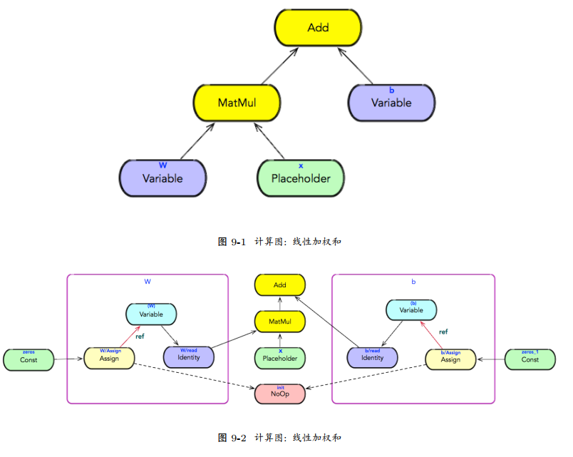
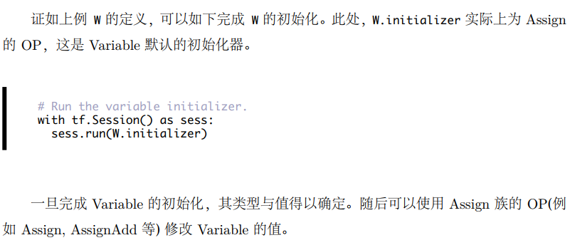

## 变量

* Variable 是一个特殊的 OP，它拥有状态。从实现技术探究， Variable 的Kernel 实现直接持有一个 Tensor 实例，其生命周期与变量一致。
相对于普通的 Tensor 实例，其生命周期仅对本次迭代 (Step) 有效；
而 Variable 对多个迭代都有效，甚至可以存储到文件系统，或从文件系统中恢复。
* 在使用变量之前，必须对变量进行初始化。按照习惯用法，使用 tf.global_variables_initializer() 将所有全局变量的初始化器汇总，并对其进行初始化。\




### 构造变量

```
class Variable(object):
def __init__(self, initial_value=None, trainable=True, collections=None, name=None, dtype=None):
    with ops.name_scope(name, "Variable", [initial_value]) as name:
        self._cons_initial_value(initial_value, dtype)
        self._cons_variable(name)
        self._cons_initializer()
        self._cons_snapshot()
        self._cons_collections(trainable, collections)
```
* 构造初始化
```
def _cons_initial_value(self, initial_value, dtype):
    self._initial_value = ops.convert_to_tensor(initial_value, name="initial_value", dtype=dtype)
```
* 构造变量 OP
```
def _cons_variable(self, name):
    self._variable = state_ops.variable_op_v2(self._initial_value.get_shape(), self._initial_value.dtype.base_dtype, name=name)
```
* 构造初始化器: Variable 的初始化器本质上是一个 Assign，它持有 Variable 的引用，并使用初始值就地修改变量本身。
```
def _cons_initializer(self):
    self._initializer_op = state_ops.assign(self._variable, self._initial_value).op
```
* 构造快照: Variable 的快照本质上是一个 Identity，表示 Variable 的当前值
```
def _cons_snapshot(self):
    with ops.colocate_with(self._variable.op):
        self._snapshot = array_ops.identity(self._variable, name="read")
```
* 变量分组
```
def _cons_collections(self, trainable, collections)
    if collections is None:
        collections = [GLOBAL_VARIABLES]
    if trainable and TRAINABLE_VARIABLES not in collections:
        collections = list(collections) + [TRAINABLE_VARIABLES]
        ops.add_to_collections(collections, self)
```   
    

