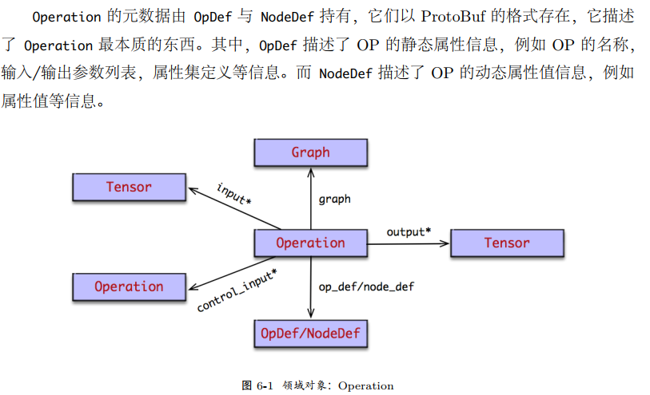
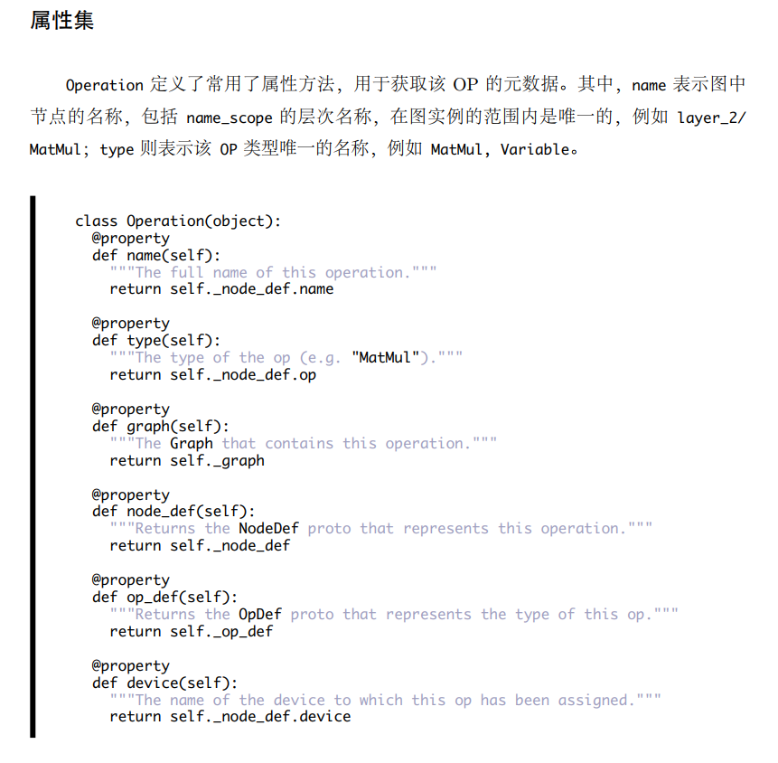
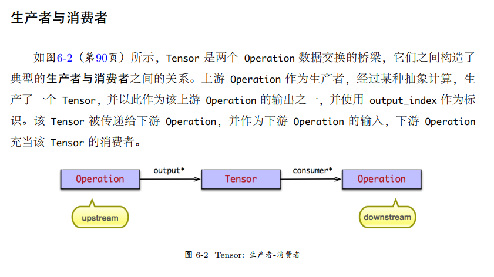

* op用于表达某种抽象的数学计算，它表示计算图中的节点。

* 可以从该 OP 为末端反向遍历图，寻找最小依赖的子图，并在默认的 Session 中执行该子图；

* Operation 的元数据由 OpDef 与 NodeDef 持有：
    * OpDef 描述了 OP 的静态属性信息，例如 OP 的名称，输入/输出参数列表，属性集定义等信息。
    * NodeDef 描述了 OP 的动态属性值信息，例如属性值等信息。
    
* 通过边将op连接的时候，
    1. 注意边如果是tensor，那么这个就是本节点的输入，原来的op是生产者，本节点是消费者；
    2. 如果边是依赖的，那么需要得到边起始点的op，然后作为本节点依赖边的集合中的元素；
* 每个op都有在图中都有一个唯一的id；

