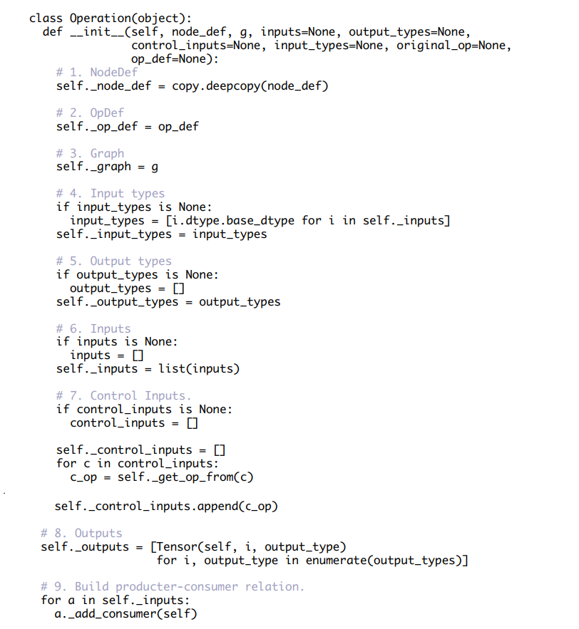
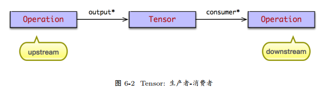
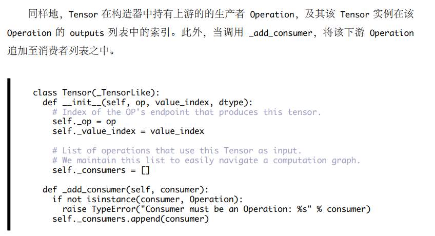
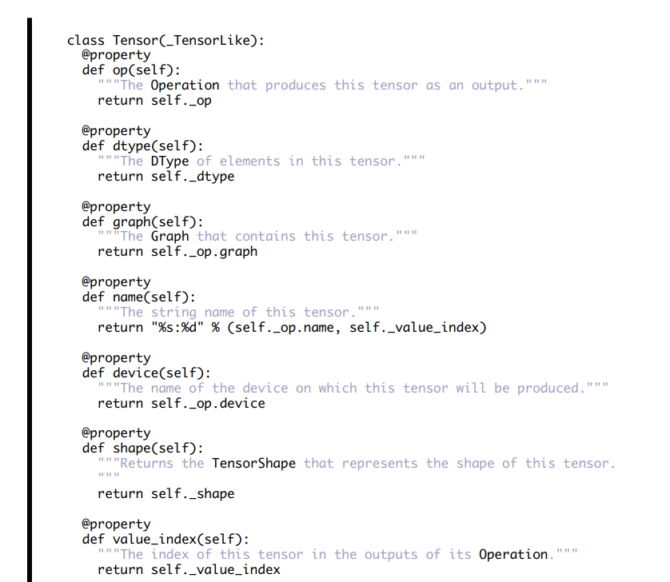
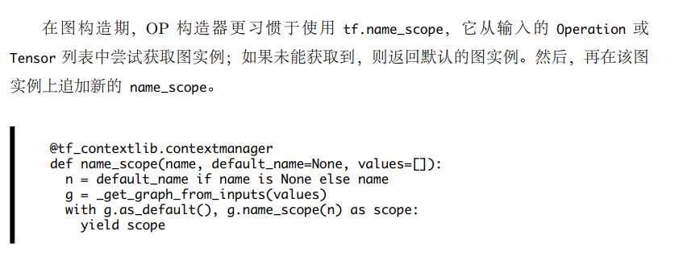
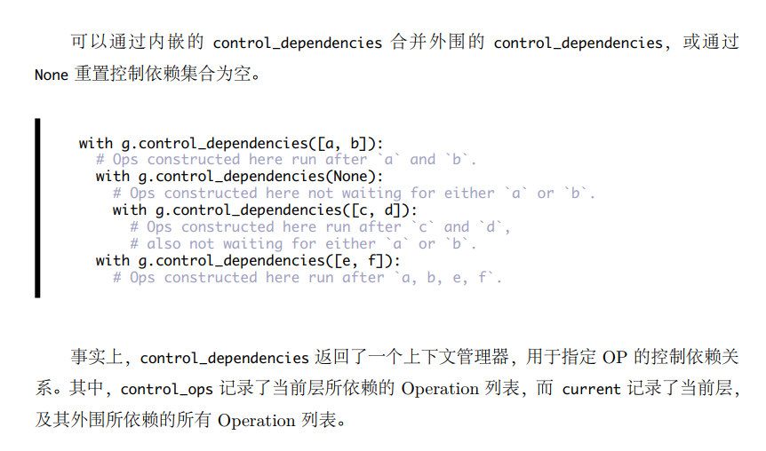
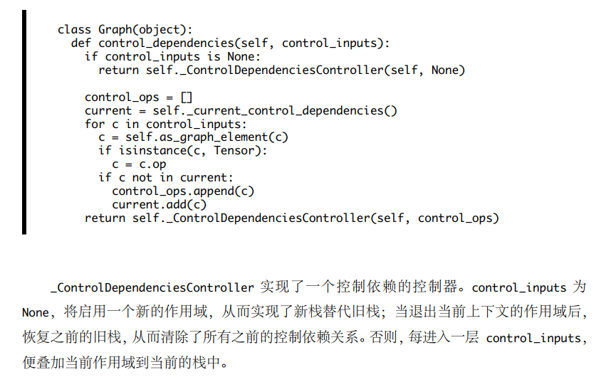
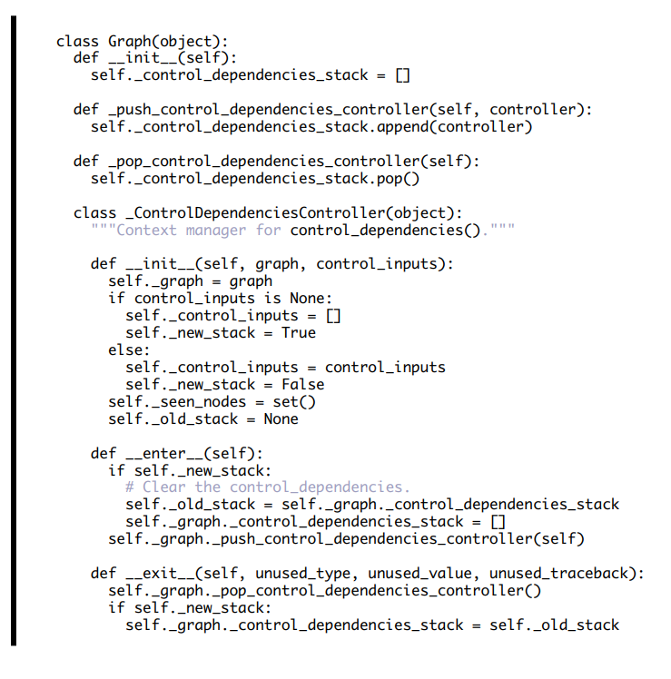
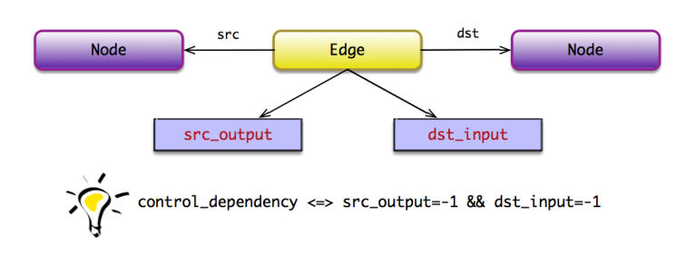

## 系统架构

### 1. 系统架构

* 整个系统分为前端和后端两个子系统
    1. 前端系统：提供编程模型，负责构建计算图
    2. 后端系统：提供运行时环境，负责执行计算图；
    

* 

### 计算图

* 在 TensorFlow 的计算图中，
    * 用op表示了节点，然后使用边表示了op之间的依赖关系，边有两种类型：
        1. Tensor承载数据，
        2. 另一种承载关系。
    * 主要以一种称为生产者消费者的形式构建图。


#### 1. Operation

* op用于表达某种抽象的数学计算，它表示计算图中的节点。



* 可以从该 OP 为末端反向遍历图，寻找最小依赖的子图，并在默认的 Session 中执行该子图；

* Operation 的元数据由 OpDef 与 NodeDef 持有：
    * OpDef 描述了 OP 的静态属性信息，例如 OP 的名称，输入/输出参数列表，属性集定义等信息。
    * NodeDef 描述了 OP 的动态属性值信息，例如属性值等信息。
    
* 通过边将op连接的时候，
    1. 注意边如果是tensor，那么这个就是本节点的输入，原来的op是生产者，本节点是消费者；
    2. 如果边是依赖的，那么需要得到边起始点的op，然后作为本节点依赖边的集合中的元素；
* 每个op都有在图中都有一个唯一的id；


#### 2. Tensor

* Tensor是两个operation数据交换的桥梁，它们之间构造了生产者与消费者之间的关系；  \

* Tensor 通过 op 持有扮演生产者角色的 Operation，并且使用index 表示该 Tensor 在该 Operation 输出列表中的索引。op:index \





#### 3. 图


* 在图构造期， OP 通过 OP 构造器创建，最终被添加至当前的 Graph 实例中。当图被冻结后，便不能往图中追加节点了，使得 Graph 实例在多线程中被安全地共享;

##### 命名空间


##### 控制依赖






##### 图构造

* 在计算图的构造期间，不执行任何 OP 的计算。
* 图的构造过程就是根据 OP构造器完成 Operation 实例的构造。而在 Operation 实例的构造之前，需要实现完成 OpDef与 NodeDef 的构造过程。


### 后端C++

#### 边

* Edge 持有前驱节点与后驱节点，从而实现了计算图的连接。一个节点可以拥有零条或多条输入边，与可以有零条或多条输出边。
一般地，计算图中存在两类边：
    1. 普通边：用于承载数据 (以 Tensor 表示)，表示节点间“生产者-消费者”的数据依赖关系，常用实线表示；
    2. 控制依赖：不承载数据，用于表示节点间的执行依赖关系，常用虚线表示。
    


#### 节点


* 输入边
```
Status Node::input_edge(int idx, const Edge** e) const {
    for (auto edge : in_edges()) {
        if (edge->dst_input() == idx) {
            *e = edge;
        return Status::OK();
        }
    }
    return errors::NotFound("not found input edge ", idx);
}
```
* 前驱节点
```
Status Node::input_node(int idx, const Node** n) const {
    const Edge* e = nullptr;
    TF_RETURN_IF_ERROR(input_edge(idx, &e));
    *n = e == nullptr ? nullptr : e->src();
    return Status::OK();
}
```

#### 图


## 会话


## OP 本质论

* 在 C++ 后端系统，系统初始化时，系统完成所有 OP 的注册。 OP 的注册是通过REGISTER_OP 宏完成的。