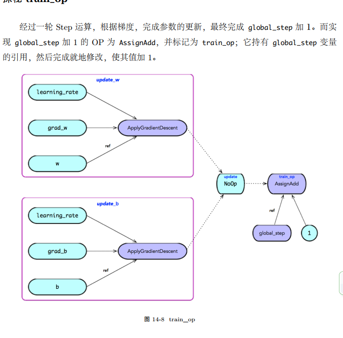

* 首先， compute_gradients 在运行时将根据 loss 的值，求解 var_list=[v1, v2, ...,vn] 的梯度，
最终返回的结果为： vars_and_grads = [(grad_v1, v1), (grad_v2, v2), ..., (grad_vn, vn)]。
* 然后， apply_gradients 迭代 grads_and_vars，对于每个 (grad_vi, vi)，构造一个更新 vi 的子图。其中，算法可以形式化地描述为：
```
def apply_gradients(grads_and_vars, learning_rate):
    for (grad, var) in grads_and_vars:
        apply_gradient_descent(learning_rate, grad, var)
```
* 其中， apply_gradient_descent 将构造一个使用梯度下降算法更新参数的计算子图。
将(grad, var) 的二元组，及其 learning_rate 的 Const OP 作为 ApplyGradientDescent 的输
入。





