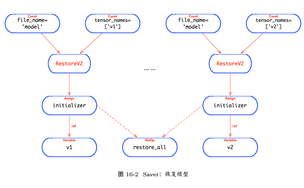

## 模型训练
 
### 1. BP 算法   
    
* 首先，根据正向子图的拓扑图，构造一个虚拟的反向子图。之所以称为虚拟的，是因为真实的反向子图要比它复杂得多；
更准确的说，虚拟的反向子图中的一个节点，对应于真实的反向子图中的一个局部子图。
* 接下来，根据虚拟的反向子图构造真实的反向子图。首先，根据该反向的虚拟子图执行拓扑排序算法，
得到该虚拟的反向子图的一个拓扑排序；然后，按照该拓扑排序，对每个正向子图中的 OP 寻找其「梯度函数」；
最后，调用该梯度函数，该梯度函数将构造该 OP 对应的反向的局部子图。

#### 梯度函数原型
```
@ops.RegisterGradient("op_name")
def op_grad_func(op, grad):
```
* 对于一个梯度函数，第一个参数 op 表示正向计算的 OP，根据它可以获取正向计算时OP 的输入和输出；
第二个参数 grad，是反向子图中上游节点传递过来的梯度，它是一个已经计算好的梯度值 (初始梯度值全为 1)。


#### 构造算法

* 首先， compute_gradients 在运行时将根据 loss 的值，求解 var_list=[v1, v2, ...,vn] 的梯度，
最终返回的结果为： vars_and_grads = [(grad_v1, v1), (grad_v2, v2), ..., (grad_vn, vn)]。
* 然后， apply_gradients 迭代 grads_and_vars，对于每个 (grad_vi, vi)，构造一个更新 vi 的子图。其中，算法可以形式化地描述为：
```
def apply_gradients(grads_and_vars, learning_rate):
    for (grad, var) in grads_and_vars:
        apply_gradient_descent(learning_rate, grad, var)
```
* 其中， apply_gradient_descent 将构造一个使用梯度下降算法更新参数的计算子图。
将(grad, var) 的二元组，及其 learning_rate 的 Const OP 作为 ApplyGradientDescent 的输
入。


### 2. 数据加载

* TensorFlow 输入样本数据到训练/推理子图中执行运算，存在三种读取样本数据的方法：
    1. 数据注入：通过字典 feed_dict 将数据传递给 Session.run，以替代 Placeholder的输出 Tensor 的值；
    2. 数据管道：通过构造输入子图，并发地从文件中读取样本数据；
    3. 数据预加载：对于小数据集，使用 Const 或 Variable 直接持有数据。


#### 使用 Const
* 由于 Const OP 输出 Tensor 的值是直接内联在计算图中。如果该 Const OP 在图中被使用多次，
可能造成重复的冗余数据，白白浪费了不必要的内存资源。


#### 数据管道

* 一个典型的数据加载的 Pipeline(Input Pipeline)，包括如下几个重要数据处理实体：
    1. 文件名称队列：将文件名称的列表加入到该队列中；
    2. 读取器：从文件名称队列中读取文件名 (出队)；并根据数据格式选择相应的文件读取器，解析文件的记录；
    3. 解码器：解码文件记录，并转换为数据样本；
    4. 预处理器：对数据样本进行预处理，包括正则化，白化等；
    5. 样本队列：将处理后的样本数据加入到样本队列中。
> 都是在构建一个一个的操作，没有执行就没有数据

#### 数据协同

* 事实上，数据加载的 Pipeline 其本质是构造一个输入子图，实现并发 IO 操作，使得训练过程不会因操作 IO 而阻塞，从而实现 GPU 的利用率的提升。


### 3. Saver

* Saver 是实现断点检查功能的基础设施，它会将所有的训练参数持久化在文件系统中；
当需要恢复训练时，可以载从文件系统中恢复计算图，及其训练参数的值。也就是说， Saver承担如下两个方面的职责：
    1. save: 将训练参数的当前值持久化到断点文件中;
    2. restore: 从断点文件中恢复训练参数的值。

#### 文件功能
```
├── checkpoint
├── ckp.data-00000-of-00001
├── ckp.index
├── ckp.meta
```
##### 索引文件: 

* 索引 (index) 文件保存了一个不可变表 (tensorflow::table::Table) 的数据；其中，关键字为 Tensor 的名称，
其值描述该 Tensor 的元数据信息，包括该 Tensor 存储在哪个数据(data) 文件中，及其在该数据文件中的偏移，及其校验和等信息。

##### 数据文件

& 数据 (data) 文件记录了所有变量 (Variable) 的值。当 restore 某个变量时，首先从索引文件中找到相应变量在哪个数据文件，
然后根据索引直接获取变量的值，从而实现变量数据的恢复。

##### 元文件

* 元文件 (meta) 中保存了 MetaGraphDef 的持久化数据，它包括 GraphDef, SaverDef 等元数据。

* 将描述计算图的元数据与存储变量值的数据文件相分离，实现了静态的图结构与动态的数据表示的分离。
因此，在恢复 (Restore) 时，先调用 tf.import_meta_graph 先将 GraphDef恢复出来，然后再恢复 SaverDef，
从而恢复了描述静态图结构的 Graph 对象，及其用于恢复变量值的 Saver 对象，最后使用 Saver.restore 恢复所有变量的值。

##### 状态文件

* Checkpoint 文件会记录最近一次的断点文件 (Checkpoint File) 的前缀，根据前缀可以找对对应的索引和数据文件。
当调用 tf.train.latest_checkpoint，可以快速找到最近一次的断点文件。
* Checkpoint 文件也记录了所有的断点文件列表，并且文件列表按照由旧至新的时间依次排序。
当训练任务时间周期非常长，断点检查将持续进行，必将导致磁盘空间被耗尽。为了避免这个问题，存在两种基本的方法：
    1. max_to_keep: 配置最近有效文件的最大数目，当新的断点文件生成时，且文件数目超过 max_to_keep，则删除最旧的断点文件；其中， max_to_keep 默认值为 5;
    2. keep_checkpoint_every_n_hours: 在训练过程中每 n 小时做一次断点检查，保证只有一个断点文件；其中，该选项默认是关闭的。
* 由于 Checkpoint 文件也记录了断点文件列表，并且文件列表按照由旧至新的时间依次排序。根据上述策略删除陈旧的断点文件将变得极其简单有效


#### 模型

##### 持久化模型

* 为了实现持久化的功能， Saver 在构造时在计算图中插入 SaveV2，及其关联的 OP。
其中， file_name 为一个 Const 的 OP，指定断点文件的名称； tensor_names 也是一个 Const的 OP，用于指定训练参数的 Tensor 名称列表。


##### 恢复模型

* 同样地，为了实现恢复功能， Saver 在构造期，为每个训练参数，插入了一个 RestoreV2，及其关联的 OP。
其中，包括从断点文件中恢复参数默认值的初始化器 (Initializer)，其本质是一个 Assign 的 OP。




### 4. MonitoredSession

* 训练一个简单的模型，可以通过运行 train_op 数次直至模型收敛，最终将训练参数实施 Checkpoint，持久化训练模型。
对于小规模的学习模型，这个过程至多需要花费数小时的时间。
* 但是，对于大规模的学习模型，需要花费数天时间；而且可能需要使用多份复本,此时需要更加健壮的训练过程支持模型的训练。因此，需要解决三个基本问题
    1. 当训练过程异常关闭，或程序崩溃，能够合理地处理异常；
    2. 当异常关闭，或程序崩溃之后，能够恢复训练过程；
    3. 能够通过 TensorBoard 监控整个训练过程。

#### 引入 MonitoredSession

* tf.train.MonitoredSession，它可以定制化 Hook，用于监听整个 Session 的生命周期；
内置 Coordinator 对象，用于协调所有运行中的线程同时停止，并监听，上报和处理异常；
当发生 AbortedError 或 UnavailableError 异常时，可以重启 Session。
