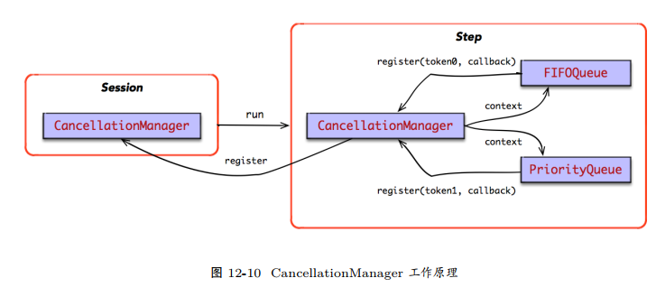

```
Status DirectSession::Close() {
    cancellation_manager_->StartCancel();
    {
        mutex_lock l(closed_lock_);
        if (closed_) return Status::OK();
        closed_ = true;
    }
    return Status::OK();
}
```
* 将 Step 注册给 DirectSession 的 CancellationManager 之中。
当 DirectSession 被关闭时， DirectSession 的 CancellationManager，将取消这次 step的执行过程；



```
Status DirectSession::Run(const NamedTensorList& inputs,const std::vector<string>& output_names,
    const std::vector<string>& target_nodes, std::vector<Tensor>* outputs) {
    // step_cancellation_manager is passed to `OpKernelContext`
    CancellationManager step_cancellation_manager;
    // Register this step with session's cancellation manager, so that `Session::Close()` will cancel the step.
    CancellationToken cancellation_token = cancellation_manager_->get_cancellation_token();
    
    bool already_cancelled = !cancellation_manager_->RegisterCallback(cancellation_token, 
        [&step_cancellation_manager]() {   
            step_cancellation_manager.StartCancel();
    });
    // ignore others...
}
```
* 当前 Step 的 CancellationManager 最终会传递给 OpKernelContext。
Kernel 实现计算时，如果保存了中间状态，可以向其注册相应的回调钩子。其中，每个回调钩子都有唯一的token 标识。
* 当 Step 被取消时，回调钩子被调用，该 Kernel 可以取消该 OP 的计算。
例如， FIFOQueue实现 TryEnqueue 时，便往本次 Step 的 CancellationManager 注册了回调钩子，用于取消该Kernel 中间的状态信息。
```
void FIFOQueue::TryEnqueue(const Tuple& tuple, OpKernelContext* ctx, DoneCallback callback) {
    CancellationManager* cm = ctx->cancellation_manager();
    CancellationToken token = cm->get_cancellation_token();
    bool already_cancelled;
    {
        mutex_lock l(mu_);
        already_cancelled = !cm->RegisterCallback(token, [this, cm, token]() { Cancel(kEnqueue, cm, token); });
    }
    // ignore others...
}
```
