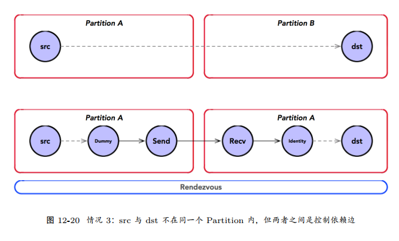

* 如果 src 与 dst 不在同一个 Partition 内，但两者之间原来是通过控制依赖边连接在一起的。
    1. 需要在 src 侧增加一个 Const 的 DummyNode，并作为 src 的下游通过控制依赖边相连；最终，在通过 Send 将其值发送到对端。
    2. 在 dst 侧， Recv 收到该值，使用 Identity 将其消费掉；最终，再将 Identity 与 dst连接控制依赖边。
    在这里， Const 扮演生产者， Identity 扮演消费者角色。既满足了跨设备间通信的需求，
    又满足原来 src 与 dst 之间的控制依赖的关系。但是，其缺点就是存在微妙的性能开销。

