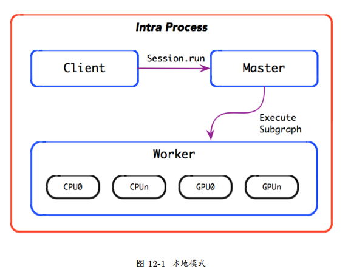
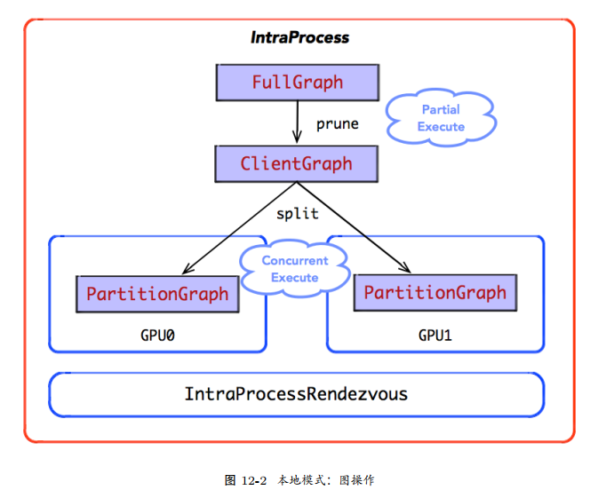
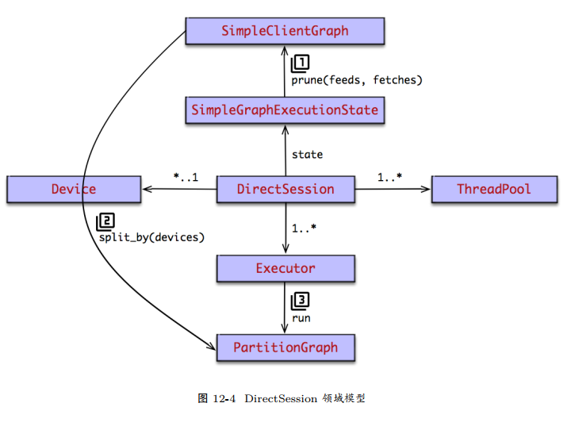
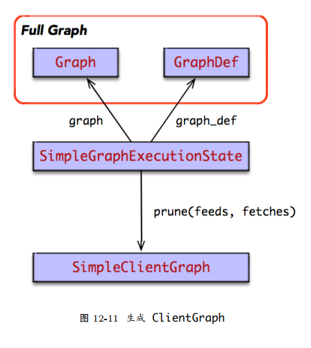
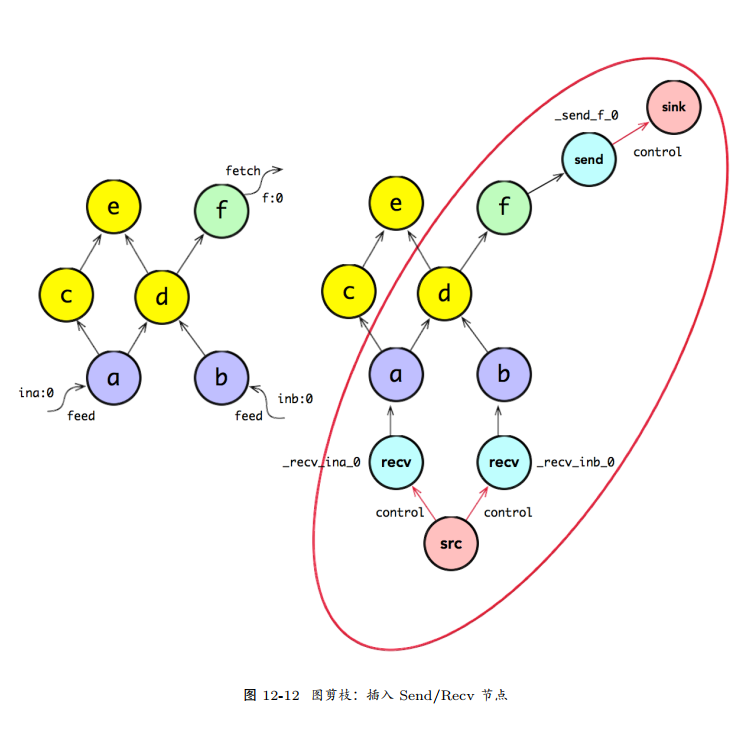
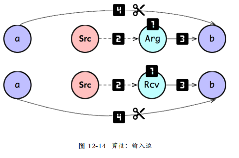
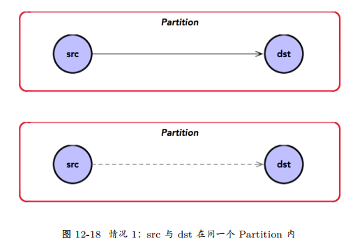
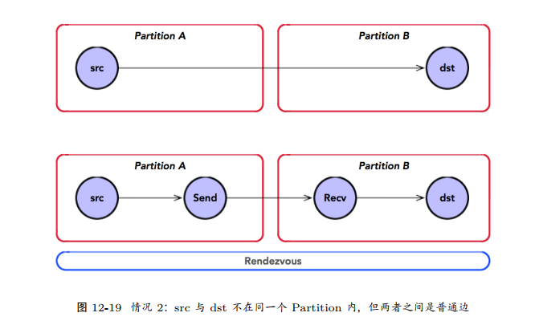

## 内容提要

* 会话
    * 图
    * 操作
* 剪枝、分裂、执行、设备间通信： 都是执行图的一部分
* 也就是将一副完整图，连剪枝成输入输出的最小图，然后分裂到设备上，分别执行，汇总交互。

## 本地执行



* Client 负责计算图的构造，通过调用 Session.run，启动计算图的执行过程。在 run_step 执行过程之中，
涉及计算图的剪枝、分裂、执行三个重要阶段；
  



## 1. 部分执行

* Master 收到计算图执行命令后，启动计算图的剪枝操作。它根据计算图的输入输出反向遍历图，寻找一个最小依赖的子图，常称为 ClientGraph。
也就是说，每次执行 run_step 时，并不会执行整个计算图 (FullGraph)，而是执行部分的子图。剪枝体现了 TensorFlow 部分执行的设计理念；


## 2. 会话控制

* 在本地模式下，其运行时由 DirectSession 控制。一般地， DirectSession 执行计算图时，各组件之间都是函数调用关系。
但是， DirectSession 也存在清晰的生命周期管理机制


### 2.1 领域模型

* DirectSession 持有 SimpleGraphExecutionState 实例，后者负责计算图的剪枝，生成 ClientGraph 实例。
* DirectSession 同时持有一组线程池，但是没次 DirectSession.run 时，根据外部配置的索引，从线程池组里选择其一为其提供服务。
因为 DirectSession 是线程安全的，支持多个并发执行的 DirectSession.run，即可以同时运行多个线程池实例。




### 2.2 创建会话


```
struct DirectSessionFactory : SessionFactory {
    bool AcceptsOptions(const SessionOptions& options) override { return options.target.empty();}
    
    Session* NewSession(const SessionOptions& options) override {
        std::vector<Device*> devices;
        DeviceFactory::AddDevices(options, "/job:localhost/replica:0/task:0", &devices);
        return new DirectSession(options, new DeviceMgr(devices));
    }
};
```
```
Status NewSession(const SessionOptions& options, Session** out_session) {
    SessionFactory* factory;
    Status s = SessionFactory::GetFactory(options, &factory);
    if (!s.ok()) {
        *out_session = nullptr;
        return s;
    }
    *out_session = factory->NewSession(options);
    if (!*out_session) {
        return errors::Internal("Failed to create session.");
    }
    return Status::OK();
}

TF_DeprecatedSession* TF_NewDeprecatedSession(const TF_SessionOptions* opt, TF_Status* status) {
    Session* session;
    status->status = NewSession(opt->options, &session);
    if (status->status.ok()) {
        return new TF_DeprecatedSession({session});
    } else {
        return nullptr;
    }
}
```
* 在DirectSession 的构造函数中，主要负责其领域模型的初始化，包括线程池的创建，构建 CancellationManager 实例
```
DirectSession::DirectSession(const SessionOptions& options, const DeviceMgr* device_mgr)
    : options_(options), device_mgr_(device_mgr), cancellation_manager_(new CancellationManager()) {
    // thread_pools_ = ...
}
```

### 2.3 销毁会话
```
void TF_DeleteDeprecatedSession(TF_DeprecatedSession* s, TF_Status* status) {
    status->status = Status::OK();
    delete s->session; // delete DirectSession
    delete s;
}
```
* 随后， DirectSession 的析构函数被调用，它负责清理其负责管理的系统资源。
主要包括 Executor 列表， ThreadPool 列表， CancellationManager 实例。
```
DirectSession::~DirectSession() {
    for (auto& it : partial_runs_) {
        it.second.reset(nullptr);
    }
    for (auto& it : executors_) {
        it.second.reset();
    }
    for (auto d : device_mgr_->ListDevices()) {
        d->op_segment()->RemoveHold(session_handle_);
    }
    delete cancellation_manager_;
    for (const auto& p_and_owned : thread_pools_) {
        if (p_and_owned.second) delete p_and_owned.first;
    }
    execution_state_.reset(nullptr);
    flib_def_.reset(nullptr);
}
```

#### 2.4 创建/扩展图

* 首次扩展图，等价于创建图。扩展图就是在原有计算图的基础上，追加新的子图。
当然，追加的子图中所包含的节点，在原有的计算图中不应该存在。
```
Status DirectSession::Create(const GraphDef& graph) {
    if (graph.node_size() > 0) {
        mutex_lock l(graph_def_lock_);
        return ExtendLocked(graph);
    }
    return Status::OK();
}
Status DirectSession::Extend(const GraphDef& graph) {
    mutex_lock l(graph_def_lock_);
    return ExtendLocked(graph);
}
```
* 当创建计算图时， DirectSession 主要完成 SimpleGraphExecutionState 实例的创建。
SimpleGraphExecutionState 实例持有 FullGraph 两种格式的实例：Graph 与 GraphDef，并由它负责管理和维护 FullGraph 的生命周期。


* 其中， SimpleGraphExecutionState 的主要职责包括：
    1. 构造 FullGraph：发生在 DirectSession.Create；
    2. 执行简单的 OP 编排算法：发生在 DirectSession.Create；
    3. 执行图的剪枝操作：发生在 DirectSession.Run。
* 当执行 DirectSession::Create 时，将创建 SimpleGraphExecutionState 实例，并完成FullGraph 实例的构建和初始化。
```
Status SimpleGraphExecutionState::MakeForBaseGraph(GraphDef* graph_def, const SimpleGraphExecutionStateOptions& opts,
    std::unique_ptr<SimpleGraphExecutionState>* out_state) {
        auto ret = std::make_unique<SimpleGraphExecutionState>(graph_def, opts));
        AddDefaultAttrsToGraphDef(&ret->original_graph_def_, *ret->flib_def_, 0));
        if (!ret->session_options_->config.graph_options().place_pruned_graph()) {
            ret->InitBaseGraph();
    }
    *out_state = std::move(ret);
    return Status::OK();
}
```
* 其中， SimpleGraphExecutionState::InitBaseGraph 完成 FullGraph 从 GraphDef 到 Graph的格式转换，并启动 SimplePlacer 的 OP 编排算法。
```
Status SimpleGraphExecutionState::InitBaseGraph() {
    auto ng = std::make_unique<Graph>(OpRegistry::Global());
    GraphConstructorOptions opts;
    ConvertGraphDefToGraph(opts, *original_graph_def_, ng.get());
    SimplePlacer placer(ng.get(), device_set_, session_options_);
    placer.Run();
    this->graph_ = ng.release();
    return Status::OK();
}
```

#### 2.5 图构造： GraphDef -> Graph

* 刚开始， SimpleGraphExecutionState 得到的是 GraphDef，这是最原始的图结构。它由Client 将序列化后传递到后端 C++，然后由后端反序列化得到的图结构
* GraphDef 是使用 protobuf 格式存在的图结构，它包含了图所有元数据；
* Graph是运行时系统中用于描述图结构的领域对象，它不仅仅持有 GraphDef 的元数据，并包含其它图结构的其它信息


#### 2.6 OP 编排： SimplePlacer

* OP 的编排 (placement) 指的是，将计算图中包含的 OP 以最高效的方式置放在合适的计算设备上运算，以最大化计算资源的利用率。


#### 2.7 迭代执行

* DirectSession.Run 是 TensorFlow 运行时的关键路径，它负责完成一次迭代计算。
首先，DirectSession 根据输入/输出对 FullGraph 实施剪枝，生成 ClientGraph；
然后，根据所持有本地设备集，将 ClientGraph 分裂为多个 PartitionGraph；
运行时为其每个 PartitionGraph启动一个 Executor 实例，后者执行 PartitionGraph 的拓扑排序算法，完成计算图的执行。


* FullGraph: Client 负责构造的完整的计算图，常称为 FullGraph；但是，一次 Session.run 并不会执行整个计算图；

* ClientGraph: Master 根据 Session.run 传递 feeds, fetches 输入输出列表，
对 FullGraph 实施剪枝操作，计算得到本地迭代执行的最小依赖子图，常称为 ClientGraph；

* PartitionGraph: Master 根据当前计算设备集，及其 OP 的设备约束规范，将 ClientGraph 分裂为多个 PartitionGraph；
其中，每个计算设备对应一个 PartitionGraph，计算设备负责 PartitionGraph 的执行。

```
def do_run_partitions(executors_and_partitions):
    barrier = ExecutorBarrier(executors_and_partitions.size())
    for (executor, partition) in executors_and_partitions:
        executor.run(partition, barrier)
    barrier.wait()
    
def run_partitions(executors_and_partitions, inputs, outputs):
    frame = FunctionCallFrame()
    frame.set_args(inputs)
    do_run_partitions(executors_and_partitions)
    frame.get_ret_vals(outputs)
    
def run_step(devices, full_graph, inputs, outputs):
    client_graph = prune(full_graph, inputs, outputs)
    executors_and_partitions = split(client_graph, devices)
    run_partitions(executors_and_partitions, inputs, outputs)
```
* 在每个计算设备上，启动一个 Executor 执行分配给它的 PartitionGraph。
当某一个计算设备执行完所分配的 PartitionGraph 之后， ExecutorBarrier 的计数器加 1，直至所有设备完成 PartitionGraph 列表的执行，
barrier.wait() 阻塞操作退出。
* 跨设备的 PartitionGraph 之间可能存在数据依赖关系，它们之间通过插入 Send/Recv节点完成交互。
事实上，在本地模式中， Send/Recv 通过 Rendezvous 完成数据交换的。 Send将数据放在 Rendezvous 上，
而 Recv 则根据标识从 Rendezvous 取走。其中， Send 不阻塞，而 Recv 是阻塞的。

#### 关闭会话

```
Status DirectSession::Close() {
    cancellation_manager_->StartCancel();
    {
        mutex_lock l(closed_lock_);
        if (closed_) return Status::OK();
        closed_ = true;
    }
    return Status::OK();
}
```
* 将 Step 注册给 DirectSession 的 CancellationManager 之中。
当 DirectSession 被关闭时， DirectSession 的 CancellationManager，将取消这次 step的执行过程；


```
Status DirectSession::Run(const NamedTensorList& inputs,const std::vector<string>& output_names,
    const std::vector<string>& target_nodes, std::vector<Tensor>* outputs) {
    // step_cancellation_manager is passed to `OpKernelContext`
    CancellationManager step_cancellation_manager;
    // Register this step with session's cancellation manager, so that `Session::Close()` will cancel the step.
    CancellationToken cancellation_token = cancellation_manager_->get_cancellation_token();
    
    bool already_cancelled = !cancellation_manager_->RegisterCallback(cancellation_token, 
        [&step_cancellation_manager]() {   
            step_cancellation_manager.StartCancel();
    });
    // ignore others...
}
```
* 当前 Step 的 CancellationManager 最终会传递给 OpKernelContext。
Kernel 实现计算时，如果保存了中间状态，可以向其注册相应的回调钩子。其中，每个回调钩子都有唯一的token 标识。
* 当 Step 被取消时，回调钩子被调用，该 Kernel 可以取消该 OP 的计算。
例如， FIFOQueue实现 TryEnqueue 时，便往本次 Step 的 CancellationManager 注册了回调钩子，用于取消该Kernel 中间的状态信息。
```
void FIFOQueue::TryEnqueue(const Tuple& tuple, OpKernelContext* ctx, DoneCallback callback) {
    CancellationManager* cm = ctx->cancellation_manager();
    CancellationToken token = cm->get_cancellation_token();
    bool already_cancelled;
    {
        mutex_lock l(mu_);
        already_cancelled = !cm->RegisterCallback(token, [this, cm, token]() { Cancel(kEnqueue, cm, token); });
    }
    // ignore others...
}
```


### 3. 剪枝

> 这里的剪枝应该是根据要求的节点，找到和相关的边，然后替换边的过程；

* DirectSession::Run 执行时，首先完成 ClientGraph 的构造。事实上， ClientGraph 的构造过程，
主要完成 FullGraph 的剪枝算法，并生成 ClientGraph。



```
BuildGraphOptions build_graph_options(const NamedTensorList& inputs, const std::vector<string>& outputs,
    const std::vector<string>& targets) {
    // sort inputs/outputs/targets
    std::vector<string> inputs_sorted(inputs.begin(), inputs.end());
    std::sort(inputs_sorted.begin(), inputs_sorted.end());
    std::vector<string> outputs_sorted(outputs.begin(), outputs.end());
    std::sort(outputs_sorted.begin(), outputs_sorted.end());
    std::vector<string> tn_sorted(targets.begin(), targets.end());
    std::sort(tn_sorted.begin(), tn_sorted.end());
    // build graph options
    BuildGraphOptions options;
    options.feed_endpoints = inputs_sorted;
    options.fetch_endpoints = outputs_sorted;
    options.target_nodes = tn_sorted;
    options.use_function_convention = !run_state_args->is_partial_run;
    return options;
}

Status DirectSession::Run(
    const RunOptions& run_options,
    const NamedTensorList& inputs,
    const std::vector<string>& output_names,
    const std::vector<string>& target_nodes,
    std::vector<Tensor>* outputs,
    RunMetadata* run_metadata) {
        // 1. prune graph
        // client_graph = prune(full_graph, inputs, outputs)
        std::unique_ptr<SimpleClientGraph> client_graph;
        execution_state_->BuildGraph(
        build_graph_options(inputs, output_names, target_nodes),
        &client_graph);
        // 2. split graph into partition by devices
        // executors_and_partitions = split(client_graph, devices)
        // 3. lauch executor per partition
        // def run_partitions(executors_and_partitions, inputs, outputs):
        // frame = FunctionCallFrame()
        // frame.set_args(inputs)
        // for (executor, partition) in executors_and_partitions:
        // exec.run(part)
        // frame.get_ret_vals(outputs)
        return Status::OK();
}
```
* ClientGraph 初始来自原始的 FullGraph，调用 RewriteGraphForExecution 函数，将根据输入/输出，对 ClientGraph 实施改写操作，
包括增加节点，或删除节点，最终生成SimpleClientGraph 实例;
```
const DeviceAttributes& SimpleGraphExecutionState::local_device_attr() const {
    return device_set_->client_device()->attributes();
}

Status SimpleGraphExecutionState::BuildGraph(const BuildGraphOptions& options, std::unique_ptr<SimpleClientGraph>* out) {
    // 1. create new_graph from origin graph, which is client graph.
    std::unique_ptr<Graph> ng;
    ng.reset(new Graph(flib_def_.get()));
    CopyGraph(*graph_, ng.get());
    
    // 2. prune the client graph
    subgraph::RewriteGraphForExecution(ng.get(), options.feed_endpoints, options.fetch_endpoints,
        options.target_nodes, local_device_attr(), options.use_function_convention);
    }
    
    // 3. create SimpleClientGraph, and return it.
    std::unique_ptr<SimpleClientGraph> dense_copy(new SimpleClientGraph(std::move(flib)));
    CopyGraph(*ng, &dense_copy->graph);
    *out = std::move(dense_copy);
    return Status::OK();
}
```
* 因此，构建 ClientGraph 过程，其关键路径为 RewriteGraphForExecution，即剪枝算法。
剪枝算法根据输入/输出列表，反向遍历 FullGraph，找到最小的依赖子图 ClientGraph。
一般地，对于 ClientGraph 输入节点，扮演了起始节点；而输出节点，扮演了终止节点。因此，关于输入和输出，存在两个比较棘手的问题
    1. 输入：当 ClientGraph 计算开始前，外部的运行时如何传递 Tensor 给输入节点；
    2. 输出：当 ClientGraph 计算完成后，外部的运行时又如何从输出节点获取 Tensor。
* 在两种媒介： FunctionCallFrame 和 Rendezvous，外部运行时与输入/输出节点可以使用其中一种媒介交换数据。
    1. FunctionCallFrame 用于 Arg/RetVal 函数调用的 OP，用于函数调用时传递函数参数值，及其返回函数值。但是，它们仅适用于单进程的运行时环境。
    2. Rendezvous 用于 Send/Recv 消息发送的 OP，这是一种更为通用的通信方式，适用于分布式的运行时环境;


#### 3.1 基于 Rendezvous

* 根据 fetches 列表，反向搜索依赖的节点，直至 feeds，计算得到最小依赖的子图；
* 对于 Feed 的边实施剪枝，例如剪枝 ina:0) 边，并在此处插入节点 Recv，并按照输入边的名字命名该节点，例如 _recv_ina_0。
* 对于 Fetch 的边也实施剪枝，例如剪枝 f:0 边，并在此处插入节点 Send 节点，并按照输出边的名字命名该节点，例如 _send_f_0。



* 输入/输出通过 Rendezvous 交换数据可能存在性能上的瓶颈。因为待发送的Tensor 需要携带发送设备，接收设备， TensorId，
共同组成了唯一的字符串标识，数据发送和接收需要花费很长的字符串解析的时间开销。


#### 3.2 基于 FunctionCallFrame

* 在本地模式下，可以使用 Arg/RetVal 分别替代 Send/Recv 节点，从而实现了函数调用交换数据的方式，替代原有基于 Rendezvous 交互数据的方式。
* 对于 Feed 的边实施剪枝，例如剪枝 ina:0) 边，并在此处插入节点 Arg，并按照输入边的名字命名该节点，例如 _arg_ina_0。
* 对于 Fetch 的边也实施剪枝，例如剪枝 f:0 边，并在此处插入节点 RetVal 节点，并按照输出边的名字命名该节点，例如 _retval_f_0。


#### 3.3 剪枝算法实现

* 剪枝算法主要由 RewriteGraphForExecution 完成，主要包括 3 个子过程。
    1. 追加输入节点
    2. 追加输出节点
    3. 反向剪枝
```
void RewriteGraphForExecution(Graph* g, bool use_function,
    const ArraySlice<string>& fed_outputs,
    const ArraySlice<string>& fetch_outputs,
    const ArraySlice<string>& target_node_names,
    const DeviceAttributes& device_info) {
    
    FeedInputs(g, use_function, device_info, fed_outputs);
    
    std::vector<Node*> fetch_nodes;
    FetchOutputs(g, use_function, device_info, fetch_outputs, &fetch_nodes);
    PruneForTargets(g, fetch_nodes, target_node_names);
}
```

##### 1. 追加输入节点

* 对于任意一条输入边实施剪枝时，插入相应的 Arg 或 Recv节点，删除既有的边，并重新连接相应的边。


```
# 得到tensor的数据类型
DataType data_type(Graph& g, const TensorId& tensor_id) {
    Node* upstream_node = g.upstream_node(tensor_id);
    return BaseType(upstream_node->output_type(tensor_id.src_output()));
}

Node* AppendRecvNode(Graph& g, const TensorId& tensor_id, const DeviceAttributes& device_info) {
    Node* recv_node;
    NodeBuilder(strings::StrCat("_recv_", tensor_id.op(), "_", tensor_id.src_output()), "_Recv")
        .Attr("tensor_type", data_type(g, tensor_id))
        .Attr("tensor_name", tensor_id.name())
        .Attr("send_device", device_info.name())
        .Attr("recv_device", device_info.name())
        .Attr("send_device_incarnation", device_info.incarnation())
        .Attr("client_terminated", true)
        .Finalize(g, &recv_node);
    return recv_node;
}

Node* AppendArgNode(Graph& g, size_t index, const TensorId& tensor_id, const DeviceAttributes& device_info) {
    Node* arg_node;
    NodeBuilder(strings::StrCat("_arg_", tensor_id.op(), "_", tensor_id.src_output()), "_Arg")
        .Attr("T", data_type(g, tensor_id))
        .Attr("index", index)
        .Finalize(g, &arg_node);
    return arg_node;
}

// 1. append arg/recv node
Node* AppendNewNode(Graph& g, bool use_function, size_t index,const TensorId& tensor_id， const DeviceAttributes& device_info) {
    if (use_function) {
        return AppendArgNode(g, index, tensor_id, device_info);
    } else {
        return AppendRecvNode(g, tensor_id, device_info);
    }
}
void AppendNewEdges(Graph& g,Node* new_node, const TensorId& tensor_id) {
    // 2. add control edge between source node and new node.
    g.AddControlEdge(g.source_node(), new_node);
    Edge* old_edge = g.edge(tensor_id);
    // 3. add edge between new node and downstream node.
    g.AddEdge(new_node, 0, old_edge->dst(), old_edge->dst_input());
    // 4. remove old edge.
    g.RemoveEdge(old_edge);
}

void FeedInputs(Graph& g, bool use_function, const DeviceAttributes& device_info, const ArraySlice<TensorId>& feeds) {
    for (size_t i = 0; i < feeds.size(); ++i) {
        Node* new_node = AppendNewNode(use_function, i, feeds[i]);
        AppendNewEdges(g, new_node, feeds[i]);
    }
}
```

##### 2. 追加输出节点

* 对于任意一条输出边实施剪枝时，插入相应的 RetVal 或 Send 节点，并将其与 Sink 节点通过控制依赖边连接。
* 对输出边实施剪枝操作。新节点与上游节点的连接关系，在构造新节点时，通过 Input 已经指定。
另外，函数直接返回了新节点 (RetVal/Send) 为终止节点，因此没必要删除原来的边，其算法与输入边的处理存在微妙的差异。
```
Node* AppendSendNode(Graph& g, const TensorId& tensor_id, const DeviceAttributes& device_info) {
    Node* send_node;
    NodeBuilder(strings::StrCat("_send_", tensor_id.op(), "_", id.src_output()), "_Send")
        // 2. add edge between upstream node and send node.
        .Input(g.upstream_node(tensor_id), tensor_id.src_output())
        .Attr("tensor_name", tensor_id.name())
        .Attr("send_device", device_info.name())
        .Attr("recv_device", device_info.name())
        .Attr("send_device_incarnation", device_info.incarnation())
        .Attr("client_terminated", true)
        .Finalize(g, &send_node);
    return send_node;
}

Node* AppendRetvalNode(Graph& g, size_t index, const TensorId& tensor_id, const DeviceAttributes& device_info) {
    Node* retval_node;
    NodeBuilder(strings::StrCat("_retval_", tensor_id.op(), "_", tensor_id.src_output(), "_", index), "_Retval")
        // 2. add edge between upstream node and retval node.
        .Input(g.upstream_node(tensor_id), tensor_id.src_output())
        .Attr("T", data_type(g, tensor_id))
        .Attr("index", index)
        .Finalize(g, &retval_node))
    return retval_node;
}

// 1. append retval/send node
Node* AppendNewNode(Graph& g, bool use_function, size_t index, const TensorId& tensor_id， const DeviceAttributes& device_info) {
    if (use_function) {
        return AppendRetvalNode(g, index, tensor_id, device_info);
    } else {
        return AppendSendNode(g, tensor_id, device_info);
    }
}

void FetchOutputs(Graph& g, bool use_function, const DeviceAttributes& device_info, const ArraySlice<TensorId>& fetches,
    std::vector<Node*>& fetch_nodes) {
    for (size_t i = 0; i < fetches.size(); ++i) {
        Node* new_node = AppendNewNode(use_function, i, fetches[i]);
        // 3. add control edge between new node and sink node.
        g->AddControlEdge(new_node, g->sink_node());
        fetch_nodes.push_back(new_node);
}
```

##### 3. 反向剪枝

* 剪枝操作，其本质就是 DAG 反向的宽度优先遍历算法。首先，创建了一个队列，及其一个 visited 数组，后者用于记录已经遍历过的节点。
初始化时，队列仅包含输出节点和输入节点 (targets)。当图遍历完毕后，不再 visited 里面的节点，表示本此执行不依赖于它，应从图中删除该节点，及其相关联的边。
* 经过剪枝后，将形成若干 DAG 子图。将入度为 0 的节点，与 Source 节点通过控制依赖边相连接；出度为 0 的节点，
与 Sink 节点通过控制依赖边相连接，最终形成一个完整的DAG 图。
```
# 反向广度遍历
void ReverseBFS(Graph* g, std::unordered_set<const Node*>& visited) {
    std::deque<const Node*> queue(visited.begin(), visited.end());
    while (!queue.empty()) {
        const Node* n = queue.front();  queue.pop_front();
        for (const Node* in : n->in_nodes()) 
            if (visited.insert(in).second) 
                queue.push_back(in);
    }
}
# 移除没有访问到的节点
void RemoveUnvisitedNodes(Graph* g, std::unordered_set<const Node*>& visited) {
    for (Node* n : g->nodes())  if (visited.count(n) == 0 && !n->IsSource() && !n->IsSink()) 
            g->RemoveNode(n);
}
# 剪枝
void PruneForReverseReachability(Graph* g, std::unordered_set<const Node*>& visited) {
    ReverseBFS(g, visited);
    RemoveUnvisitedNodes(g, visited);
}
# 将入度为0加入source控制边
void FixupSourceEdges(Graph* g, Node* n) {
    if (!n->IsSource() && n->in_edges().empty()) 
        g->AddControlEdge(g->source_node(), n);
}
# 将出度为0的加入sink控制边
void FixupSinkEdges(Graph* g, Node* n) {
    if (!n->IsSink() && n->out_edges().empty()) 
        g->AddControlEdge(n, g->sink_node());
}

void FixupSourceAndSinkEdges(Graph* g) {
    for (Node* n : g->nodes()) {
        FixupSourceEdges(g, n);
        FixupSinkEdges(g, n);
    }
}

void AppendTargetNodes(Graph& g, const ArraySlice<string>& target_names, std::unordered_set<const Node*>& targets) {
    for (auto name : target_names) {
        Node* target = g.GetNodeBy(name);
        targets.insert(target);
    }
}

void PruneForTargets(Graph* g, std::vector<Node*>& fetch_nodes, const ArraySlice<string>& target_names) {
    std::unordered_set<const Node*> targets(begin(fetch_nodes), end(fetch_nodes));
    AppendTargetNodes(g, target_names, targets);
    PruneForReverseReachability(g, targets);
    FixupSourceAndSinkEdges(g);
}
```


### 4 分裂


* 因此，计算图中存在若干条边跨越设备。对于跨越设备的边，运行时将其分裂，并就地插入 Send/Recv 边，
分别用于原设备上发送数据，并在目标设备上接受数据，完成设备间的数据交换。


#### 情况一

* 最简单的情况下， src 与 dst 在同一个 Partition 内。因此，直接将其划归在同一个Partition 即可。



#### 情况 2

* 如果 src 与 dst 不在同一个 Partition 内，但两者之间原来是通过普通边连接在一起的。
因此，仅需要在它们中间增加 Send 与 Recv 节点，将其划归在两个不同的 Partition内。



#### 情况 3

* 如果 src 与 dst 不在同一个 Partition 内，但两者之间原来是通过控制依赖边连接在一起的。
    1. 需要在 src 侧增加一个 Const 的 DummyNode，并作为 src 的下游通过控制依赖边相连；最终，在通过 Send 将其值发送到对端。
    2. 在 dst 侧， Recv 收到该值，使用 Identity 将其消费掉；最终，再将 Identity 与 dst连接控制依赖边。
    在这里， Const 扮演生产者， Identity 扮演消费者角色。既满足了跨设备间通信的需求，
    又满足原来 src 与 dst 之间的控制依赖的关系。但是，其缺点就是存在微妙的性能开销。


#### 分裂算法实现

* 分裂算法也是一个反向遍历图的算法。对于当前遍历的节点，将其标记为 dst；然后再寻找 dst 的所有输入边；遍历所有输入边，
从而找到与改边相连的源节点，将其标记为src。
```
using Edges = std::vector<const Edge*>;
using Partitions = std::unordered_map<string, GraphDef>;
void AddInput(NodeDef* dst, StringPiece src_name, int src_slot) {
    if (src_slot == Graph::kControlSlot) {
        dst->add_input(strings::StrCat("^", src_name));
    } else if (src_slot == 0) {
        dst->add_input(src_name.data(), src_name.size());
    } else {
        dst->add_input(strings::StrCat(src_name, ":", src_slot));
    }
}

Edges InputsOf(const Node* dst) {
    Edges inputs(dst->num_inputs(), nullptr);
    for (auto edge : dst.in_edges()) {
    if (edge->IsControlEdge()) {
        inputs.push_back(e);
    } else {
        inputs[edge->dst_input()] = edge;
    }
    return inputs;
}

NodeDef* InitDstNodeDef(const Node& dst, NodeDef* dst_def) {
    dst_def = dst.def();
    dst_def->set_device(dst.assigned_device_name());
    dst_def->clear_input();
    return dst_def;
}

NodeDef* AddDummyConst(const PartitionOptions& opts, GraphDef* gdef, const Edge* edge, Status* status) {
    const Node* src = edge->src();
    Tensor tensor(DT_FLOAT, TensorShape({0}));
    NodeDef* result = gdef->add_node();
    *status = NodeDefBuilder(opts.new_name(src->name()), "Const")
                            .Device(src->assigned_device_name())
                            .Attr("dtype", DT_FLOAT)
                            .Attr("value", tensor)
                            .Finalize(result);
    return result;
}

NodeDefBuilder::NodeOut BuildSendFrom(const PartitionOptions& opts, GraphDef* src_graph, const Edge* edge,
    NodeDefBuilder::NodeOut& send_from) {
    if (edge->IsControlEdge()) {
        // Case 3: DummyNode(Const) -ctrl-> src -> send
        NodeDef* dummy = AddDummyConst(opts, src_graph, edge);
        AddInput(dummy, edge->src()->name(), Graph::kControlSlot);
        send_from.Reset(dummy->name(), 0, DT_FLOAT);
    } else {
        // Case 2: src -> send
        send_from.Reset(edge->src()->name(),
        edge->src_output(),
        EdgeType(edge));
    }
}

void SetSendRecvAttrs(const PartitionOptions& opts, const Edge* edge, NodeDefBuilder* builder) {
    builder->Attr("tensor_name", strings::StrCat("edge_", edge->id(), "_", edge->src()->name()));
    builder->Attr("send_device", edge->src()->assigned_device_name());
    builder->Attr("send_device_incarnation", static_cast<int64>(opts.get_incarnation(edge->src()->assigned_device_name())));
    builder->Attr("recv_device", edge->dst()->assigned_device_name());
    builder->Attr("client_terminated", false);
}

NodeDef* AddSend(const PartitionOptions& opts,GraphDef* gdef,const Edge* edge,NodeDefBuilder::NodeOut send_from) {
    NodeDef* send = gdef->add_node();
    NodeDefBuilder builder(opts.new_name(edge->src()->name()), "_Send");
    SetSendRecvAttrs(opts, edge, &builder);
    builder.Device(edge->src()->assigned_device_name())
            .Input(send_from)
            .Finalize(send);
    return send;
}

NodeDef* AddRecv(const PartitionOptions& opts, const GraphInfo& g_info, GraphDef* gdef, const Edge* edge,
            NodeDef** real_recv, Status* status) {
    NodeDef* recv = gdef->add_node();
    NodeDefBuilder builder(opts.new_name(src->name()), "_Recv");
    SetSendRecvAttrs(opts, edge, &builder);
    builder.Device(dst->assigned_device_name())
            .Attr("tensor_type", EdgeType(edge))
            .Finalize(recv);
    return recv;
    if (edge->IsControlEdge()) {
        // Case 3: Recv -> Identity -contrl-> dst
        NodeDef* id = gdef->add_node();
        NodeDefBuilder(opts.new_name(src->name()), "Identity")
                .Device(dst->assigned_device_name())
                 .Input(recv->name(), 0, cast_dtype)
                 .Finalize(id);
        return id;
    } else {
        return recv;
    }
}

void InsertSendRecv(const PartitionOptions& opts,GraphDef* src_graph,Edge* edge,GraphDef* dst_graph,NodeDef* dst_def) {
    NodeDefBuilder::NodeOut send_from;
    BuildSendFrom(opts, src_graph, edge, send_from);
    NodeDef* send = AddSend(opts, src_graph, edge, send_from);
    NodeDef* recv = AddRecv(opts, dst_graph, edge);
    if (edge->IsControlEdge()) {
        // Case 3: In fact, recv is identity.
        AddInput(dst_def, recv->name(), Graph::kControlSlot);
    } else {
        AddInput(dst_def, recv->name(), 0);
    }
}

Status Partition(const PartitionOptions& opts, Partitions& partitions, Graph& client_graph) {
    for (const Node* dst : client_graph.op_nodes()) {
        // 1. find dst node
        GraphDef* dst_graph = &partitions[opts.node_to_loc(dst)];
        NodeDef* dst_def = InitDstNodeDef(*dst, dst_graph->add_node());
        // 2. search all input edges.
        for (const Edge* edge : InputsOf(dst)) {
            // 3. find src node: edge->src()
            GraphDef* src_graph = &partitions[opts.node_to_loc(src)];
            // skip sink/source nodes.
            if (!edge->src()->IsOp()) continue;
            // Case 1: same partition
            if (src_graph == dst_graph) {
                AddInput(dst_def, src->name(), edge->src_output());
                continue;
            }
            // Case 2-3: different partition
            InsertSendRecv(opts, src_graph, edge, dst_graph, dst_def);
        }
    }
}
```

#### 回调函数

* 在 PartitionOptions 中，存在两个重要的回调函数。 NodeToLocFunc 用于图分裂；NewNameFunc 用于给新增加的节点命名，例如 Send/Recv。
```
struct PartitionOptions {
    typedef std::function<string(const Node*)> NodeToLocFunc;
    NodeToLocFunc node_to_loc = nullptr;
    typedef std::function<string(const string&)> NewNameFunc;
    NewNameFunc new_name = nullptr;
    // ignore others...
};
```
* 对于图分裂，存在两种最基本的分裂方法
```
string SplitByDevice(const Node* node) {
    return node->assigned_device_name();    
}

string SplitByWorker(const Node* node) {
    string task, device;
    DeviceNameUtils::SplitDeviceName(node->assigned_device_name(), &task, &device);
    return task;
}
```


### 5. 执行

* 接下来，运行时将并发执行各个 PartitionGraph。每个PartitionGraph 启动一个 Executor，实现并发执行图的计算。
* 每个 Executor 将执行 PartitionGraph 的拓扑排序算法，将入度为 0 的 OP 追加到ready_queue 之中，并将其关联的 OP 的入度减 1。
调度器调度 ready_queue 之中 OP ，并将其放入 ThreadPool 中执行对应的 Kernel 实现。
* 在所有 Partition 开始并发执行之前，需要外部将其输入传递给相应的 Arg 节点；当所有 Partition 完成计算后，
外部再从 RetVal 节点中取走数据。其中， Arg/RetVal 节点之间的数据时通过 FunctionCallFrame 完成交互的。
* 如果 PartitionGraph 之间需要跨设备交换数据，生产者将其放在 Send 节点，消费者通过 Recv 节点获取数据。
其中，发送方不阻塞；接收方如果数据未到，则发生阻塞直至超时。此外， Send/Recv 节点之间的数据是通过 Rendezvous 完成交互的。


* 执行图计算需要解决如下 3 个核心问题：
    1. 输入/输出处理
    2. 设备间数据交换
    3. 执行 PartitionGraph

#### 5.1 输入

* 在某个设备上， PartitionGraph 的起始节点为 Arg 节点，结束节点为 RetVal 节点。
整个过程可以看成函数调用过程， Arg 用于传递函数参数， RetVal 用于返回函数值。
* 更确切地说， Arg 完成 PartitionGraph 的输入， RetVal 完成 PartitionGraph 的输出。
对于 Arg 节点，其调用时序为： set_arg -> get_arg。其中，前者由 DirectSession 在启动Executor 列表之前，
通过调用 FunctionCallFrame.SetArgs(feeds)，传递输入参数列表的值；后者由 Arg 的 Kernel 实现调用。
```
Status DirectSession::Run(const RunOptions& run_options,const NamedTensorList& inputs,const std::vector<string>& output_names,
    const std::vector<string>& target_nodes,std::vector<Tensor>* outputs,RunMetadata* run_metadata) {
    // 1. prune graph
    // 2. split graph into partition by devices
    // 3. lauch executor per partition
    // 3.1 construct FunctionCallFrame
    FunctionCallFrame call_frame(executors_and_keys->input_types,executors_and_keys->output_types);
    // 3.2 frame.set_args(inputs)
    // 3.2.1 construct feeds list
    gtl::InlinedVector<Tensor, 4> feed_args(inputs.size());
    for (const auto& it : inputs) {
        // (first, second) => (tensor_name, tensor)
        feed_args[executors_and_keys->input_name_to_index[it.first]] = it.second;
    }
    // 3.2.2 frame.set_args(feeds)
    call_frame.SetArgs(feed_args);
    // 3.3 concurent execution
    // for (executor, partition) in executors_and_partitions:
    // executor.run(partition)
    // 3.4 fetch outputs.
}
```
* frame.get_arg 则由 Arg 来获取，并且 Arg 将其输出到 PartitionGraph 中的第一个计算节点。
```
struct ArgOp : OpKernel {
    explicit ArgOp(OpKernelConstruction* ctx) : OpKernel(ctx) {
        ctx->GetAttr("T", &dtype_);
        ctx->GetAttr("index", &index_);
    }
    void Compute(OpKernelContext* ctx) override {
        auto frame = ctx->call_frame();
        Tensor val;
        frame->GetArg(index_, &val);
        // put it into downsteram op's input.
        ctx->set_output(0, val);
    }
    private:
        int index_;
        DataType dtype_;
};
```

#### 并发执行
* 经过图分裂后，运行为每个 Partition 启动一个 Executor。为了监听所有 Executor是否全部完成，
创建了一个 ExecutorBarrier。并且在启动所有 Executor 之后，调用executors_done.Wait() 阻塞，等待所有 Executor 完成执行。
* 当完成一个 Executor 中完成， ExecutorBarrier 的计算器减 1(初始值为 num_executors)，直至为 0，
将调用其完成钩子，最终触发 executors_done.Notify()。
```
Status DirectSession::Run(const RunOptions& run_options,const NamedTensorList& inputs,const std::vector<string>& output_names,
const std::vector<string>& target_nodes,std::vector<Tensor>* outputs,RunMetadata* run_metadata) {
    // 1. prune graph
    // 2. split graph into partition by devices
    // 3. lauch executor per partition
    // 3.1 construct FunctionCallFrame
    FunctionCallFrame call_frame(executors_and_keys->input_types,executors_and_keys->output_types);
    // 3.2 frame.set_args(inputs)
    // 3.2.1 construct feeds list
    gtl::InlinedVector<Tensor, 4> feed_args(inputs.size());
    for (const auto& it : inputs) {
        // (first, second) => (tensor_name, tensor)
        feed_args[executors_and_keys->input_name_to_index[it.first]] = it.second;
    }
    // 3.2.2 frame.set_args(feeds)
    call_frame.SetArgs(feed_args);
    // 3.3 concurent executiond_partitions.siz
    RunState run_state(&devices_);
    run_state.rendez = new IntraProcessRendezvous(device_mgr_.get());
    // 3.3.1 notify when finished.
    size_t num_executors = executors_and_keys->items.size();
    ExecutorBarrier* barrier = new ExecutorBarrier(num_executors, run_state.rendez, [&run_state](const Status& ret) {
    {
        mutex_lock l(run_state.mu_);
        run_state.status.Update(ret);
    }
    run_state.executors_done.Notify();
    });
    Executor::Args args;
    args.call_frame = &call_frame;
    args.rendezvous = run_state.rendez;
    args.runner = [this, pool](Executor::Args::Closure c) { SchedClosure(pool, std::move(c)); };
    // 3.3.2 lauch all executors.
    for (const auto& item : executors_and_keys->items) {
        item.executor->RunAsync(args, barrier->Get());
    }
    // 3.3.3 wait until all executors finished.
    WaitForNotification(&run_state, &step_cancellation_manager, GetTimeoutInMs(run_options));
    // 3.4 fetch outputs.
}
```

#### 输出

* 对于 RetVal 节点，其调用时序为： set_ret_val -> get_ret_val。前者由 RetVal完成，后者由 DirectSession 完成。
```
struct RetvalOp : OpKernel {
    explicit RetvalOp(OpKernelConstruction* ctx) : OpKernel(ctx) {
        ctx->GetAttr("T", &dtype_);
        ctx->GetAttr("index", &index_);
    }
    void Compute(OpKernelContext* ctx) override {
        // get upstream op's output.
        const Tensor& val = ctx->input(0);
        auto frame = ctx->call_frame();
        frame->SetRetval(index_, val);
    }
    private:
        int index_;
        DataType dtype_;
};
```
* 等所有 Executor 运行结束后， DirectSession 便可以从 FunctionCallFrame 中取出所有输出值，并将其放置在 outputs，并返回 Client。
```
Status DirectSession::Run(const RunOptions& run_options,const NamedTensorList& inputs,const std::vector<string>& output_names,
    const std::vector<string>& target_nodes,std::vector<Tensor>* outputs,RunMetadata* run_metadata) {
    // 1. prune graph
    // 2. split graph into partition by devices
    // 3. lauch executor per partition
    // 3.1 construct FunctionCallFrame
    FunctionCallFrame call_frame(executors_and_keys->input_types,executors_and_keys->output_types);
    // 3.2 frame.set_args(inputs)
    // 3.2.1 construct feeds list
    gtl::InlinedVector<Tensor, 4> feed_args(inputs.size());
    for (const auto& it : inputs) {
        // (first, second) => (tensor_name, tensor)
        feed_args[executors_and_keys->input_name_to_index[it.first]] = it.second;
    }
    // 3.2.2 frame.set_args(feeds)
    call_frame.SetArgs(feed_args);
    // 3.3 concurent execution
    RunState run_state(&devices_);
    run_state.rendez = new IntraProcessRendezvous(device_mgr_.get());
    // 3.3.1 notify when finished.
    size_t num_executors = executors_and_keys->items.size();
    ExecutorBarrier* barrier = new ExecutorBarrier(
    num_executors, run_state.rendez, [&run_state](const Status& ret) {
        {
        mutex_lock l(run_state.mu_);
        run_state.status.Update(ret);
        }
        run_state.executors_done.Notify();
    });
    Executor::Args args;
    args.call_frame = &call_frame;
    args.rendezvous = run_state.rendez;
    args.runner = [this, pool](Executor::Args::Closure c) {
    SchedClosure(pool, std::move(c));
    };
    // 3.3.2 lauch all executors.
    for (const auto& item : executors_and_keys->items) {
        item.executor->RunAsync(args, barrier->Get());
    }
    // 3.3.3 wait until all executors finished.
    WaitForNotification(&run_state,&step_cancellation_manager,GetTimeoutInMs(run_options));
    // 3.4 fetch outputs.
    // 3.4.1 frame.get_get_ret_vals
    std::vector<Tensor> sorted_outputs;
    Status s = call_frame.ConsumeRetvals(&sorted_outputs);
    // 3.4.2 emplace to outputs, and return to client.
    outputs->reserve(sorted_outputs.size());
    for (int i = 0; i < output_names.size(); ++i) {
        const string& output_name = output_names[i];
        outputs->emplace_back(std::move(sorted_outputs[executors_and_keys->output_name_to_index[output_name]]));
    }
}
```

> 在最后一公里，还要探究三件事情。
1. SendOp 与 RecvOp 的工作原理
2. IntraProcessRendezvous 的工作原理
3. Executor 的调度算法


### 6 设备间通信

* SendOp/RecvOp 通过 Rendezvous 交换数据的；它实现了消息发送/接受，与具体消息传递相解耦。
例如，在单进程内， SendOp/RecvOp 基于 IntraProcessRendezvous 传递数据的；
而在多进程环境中， SendOp/RecvOp 则可以基于 GrpcRendezvous 传递数据。
* 首先，探究这两个 OP 的工作原理；然后，再探究本地模式下， IntraProcessRendezvous的工作原理。


#### SendOp 实现


* 参考 SendOp 的 Kernel 实现，看起来非常复杂，但是它实际上就做了一件事情。首先，它构造设备间通信的关键字 ParsedKey，
然后调用 Rendezvous.Send 操作，将上游 OP 输入到 SendOp 的 Tensor 发送到 Rendezvous 缓存之中，该操作是非阻塞的；
* ParsedKey 包括：发送设备，接受设备，设备全局标识，及其待发送 Tensor 的标识 (src:output_index) 组成。
```
struct SendOp : OpKernel {
explicit SendOp(OpKernelConstruction* ctx) : OpKernel(ctx) {
    string send_device;
    ctx->GetAttr("send_device", &send_device);
    string recv_device;
    ctx->GetAttr("recv_device", &recv_device);
    uint64 send_device_incarnation;
    ctx->GetAttr("send_device_incarnation", reinterpret_cast<int64*>(&send_device_incarnation));
    string tensor_name;
    ctx->GetAttr("tensor_name", &tensor_name);
    key_prefix_ = GetRendezvousKeyPrefix(send_device, recv_device,send_device_incarnation, tensor_name);
    GetRendezvousKey(key_prefix_, {0, 0}, &parsed_key_.buf_);
    Rendezvous::ParseKey(parsed_key_.buf_, &parsed_key_);
    if (!ctx->GetAttr("_hostmem_sendrecv", &hostmem_sendrecv_).ok()) {
        hostmem_sendrecv_ = false;
    }
}

void Compute(OpKernelContext* ctx) override {
    Rendezvous::Args args;
    args.device_context = ctx->op_device_context();
    args.alloc_attrs = ctx->input_alloc_attr(0);
    // get it from upstream op's output, and as this op's input.12.6 设备间通信 185
    ctx->rendezvous()->Send(CreateParsedkey(ctx), args, ctx->input(0), ctx->is_input_dead());
}

private:
    Rendezvous::ParsedKey CreateParsedkey(OpKernelContext* ctx) {
        FrameAndIter frame_iter = GetFrameAndIter(ctx, hostmem_sendrecv_);
        if (frame_iter == FrameAndIter(0, 0)) {
            return parsed_key_;
        } else {
            Rendezvous::ParsedKey in_loop_parsed;
            GetRendezvousKey(key_prefix_, frame_iter, &in_loop_parsed.buf_);
            Rendezvous::ParseKey(in_loop_parsed.buf_, &in_loop_parsed);
            return in_loop_parsed;
        }
    }
private:
    string key_prefix_;
    Rendezvous::ParsedKey parsed_key_;
    bool hostmem_sendrecv_;
};
```

#### RecvOp 实现

* 首先构造 Rendezvous 的 ParsedKey，然后调用 Rendezvous.RecvAsync 操作，从 Rendezvous 取出相应的 Tensor。
这是一个异步操作，当 Rendezvous 中数据可获取，便开始执行回调函数 done_cb，它将其得到的 Tensor 输出到下游 OP。
```
struct RecvOp : AsyncOpKernel {
explicit RecvOp(OpKernelConstruction* ctx) : AsyncOpKernel(ctx) {
    string send_device;
    ctx->GetAttr("send_device", &send_device);
    string recv_device;
    ctx->GetAttr("recv_device", &recv_device);
    uint64 send_device_incarnation;
    ctx->GetAttr("send_device_incarnation",reinterpret_cast<int64*>(&send_device_incarnation));
    string tensor_name;
    ctx->GetAttr("tensor_name", &tensor_name);
    key_prefix_ = GetRendezvousKeyPrefix(send_device, recv_device,send_device_incarnation, tensor_name);
    GetRendezvousKey(key_prefix_, {0, 0}, &parsed_key_.buf_);
    Rendezvous::ParseKey(parsed_key_.buf_, &parsed_key_));
    if (!ctx->GetAttr("_hostmem_sendrecv", &hostmem_sendrecv_).ok())
        hostmem_sendrecv_ = false;
}

void ComputeAsync(OpKernelContext* ctx, DoneCallback done) override {
    Rendezvous::Args args;
    args.device_context = ctx->op_device_context();
    args.alloc_attrs = ctx->output_alloc_attr(0);
    ctx->rendezvous()->RecvAsync(CreateParsedKey(ctx), args, CreateDoneCallback(ctx));
}

private:
Rendezvous::ParsedKey CreateParsedKey(OpKernelContext* ctx) {
    FrameAndIter frame_iter = GetFrameAndIter(ctx, hostmem_sendrecv_);
    if (frame_iter == FrameAndIter(0, 0)) {
        return parsed_key_;
    } else {
        Rendezvous::ParsedKey in_loop_parsed;
        GetRendezvousKey(key_prefix_, frame_iter, &in_loop_parsed.buf_);
        Rendezvous::ParseKey(in_loop_parsed.buf_, &in_loop_parsed);
        return in_loop_parsed;
    }
}

Rendezvous::DoneCallback CreateDoneCallback(OpKernelContext* ctx) {
    using namespace std::placeholders;
    return std::bind([ctx](DoneCallback done, const Status& s,const Rendezvous::Args&, const Rendezvous::Args&, 
        const Tensor& val, bool is_dead) {
            ctx->SetStatus(s);
            if (s.ok()) {
                if (!is_dead) {
                    // put it into downstream op's input.
                    ctx->set_output(0, val);
                }
                *ctx->is_output_dead() = is_dead;
            }
            done();
        },
    std::move(done), _1, _2, _3, _4, _5);
}
private:
string key_prefix_;
    Rendezvous::ParsedKey parsed_key_;
    bool hostmem_sendrecv_;
};
```


