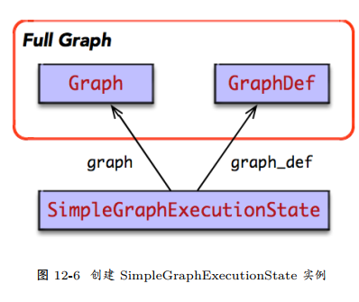
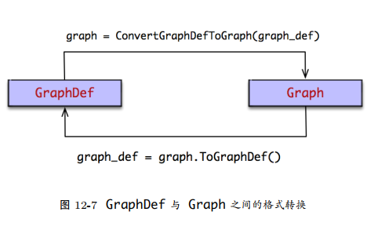

## 本地执行


* Client 负责计算图的构造，通过调用 Session.run，启动计算图的执行过程。在 run_step 执行过程之中，
涉及计算图的剪枝、分裂、执行三个重要阶段；
  


## 1. 部分执行

* Master 收到计算图执行命令后，启动计算图的剪枝操作。它根据计算图的输入输出反向遍历图，寻找一个最小依赖的子图，常称为 ClientGraph。
也就是说，每次执行 run_step 时，并不会执行整个计算图 (FullGraph)，而是执行部分的子图。剪枝体现了 TensorFlow 部分执行的设计理念；


## 2. 会话控制

* 在本地模式下，其运行时由 DirectSession 控制。一般地， DirectSession 执行计算图时，各组件之间都是函数调用关系。
但是， DirectSession 也存在清晰的生命周期管理机制


### 2.1 领域模型

* DirectSession 持有 SimpleGraphExecutionState 实例，后者负责计算图的剪枝，生成 ClientGraph 实例。
* DirectSession 同时持有一组线程池，但是没次 DirectSession.run 时，根据外部配置的索引，从线程池组里选择其一为其提供服务。
因为 DirectSession 是线程安全的，支持多个并发执行的 DirectSession.run，即可以同时运行多个线程池实例。


### 2.2 创建会话


```
struct DirectSessionFactory : SessionFactory {
    bool AcceptsOptions(const SessionOptions& options) override { return options.target.empty();}
    
    Session* NewSession(const SessionOptions& options) override {
        std::vector<Device*> devices;
        DeviceFactory::AddDevices(options, "/job:localhost/replica:0/task:0", &devices);
        return new DirectSession(options, new DeviceMgr(devices));
    }
};
```
```
Status NewSession(const SessionOptions& options, Session** out_session) {
    SessionFactory* factory;
    Status s = SessionFactory::GetFactory(options, &factory);
    if (!s.ok()) {
        *out_session = nullptr;
        return s;
    }
    *out_session = factory->NewSession(options);
    if (!*out_session) {
        return errors::Internal("Failed to create session.");
    }
    return Status::OK();
}

TF_DeprecatedSession* TF_NewDeprecatedSession(const TF_SessionOptions* opt, TF_Status* status) {
    Session* session;
    status->status = NewSession(opt->options, &session);
    if (status->status.ok()) {
        return new TF_DeprecatedSession({session});
    } else {
        return nullptr;
    }
}
```
* 在DirectSession 的构造函数中，主要负责其领域模型的初始化，包括线程池的创建，构建 CancellationManager 实例
```
DirectSession::DirectSession(const SessionOptions& options, const DeviceMgr* device_mgr)
    : options_(options), device_mgr_(device_mgr), cancellation_manager_(new CancellationManager()) {
    // thread_pools_ = ...
}
```

### 2.3 销毁会话
```
void TF_DeleteDeprecatedSession(TF_DeprecatedSession* s, TF_Status* status) {
    status->status = Status::OK();
    delete s->session; // delete DirectSession
    delete s;
}
```
* 随后， DirectSession 的析构函数被调用，它负责清理其负责管理的系统资源。
主要包括 Executor 列表， ThreadPool 列表， CancellationManager 实例。
```
DirectSession::~DirectSession() {
    for (auto& it : partial_runs_) {
        it.second.reset(nullptr);
    }
    for (auto& it : executors_) {
        it.second.reset();
    }
    for (auto d : device_mgr_->ListDevices()) {
        d->op_segment()->RemoveHold(session_handle_);
    }
    delete cancellation_manager_;
    for (const auto& p_and_owned : thread_pools_) {
        if (p_and_owned.second) delete p_and_owned.first;
    }
    execution_state_.reset(nullptr);
    flib_def_.reset(nullptr);
}
```

#### 2.4 创建/扩展图

* 首次扩展图，等价于创建图。扩展图就是在原有计算图的基础上，追加新的子图。
当然，追加的子图中所包含的节点，在原有的计算图中不应该存在。
```
Status DirectSession::Create(const GraphDef& graph) {
    if (graph.node_size() > 0) {
        mutex_lock l(graph_def_lock_);
        return ExtendLocked(graph);
    }
    return Status::OK();
}
Status DirectSession::Extend(const GraphDef& graph) {
    mutex_lock l(graph_def_lock_);
    return ExtendLocked(graph);
}
```
* 当创建计算图时， DirectSession 主要完成 SimpleGraphExecutionState 实例的创建。
SimpleGraphExecutionState 实例持有 FullGraph 两种格式的实例：Graph 与 GraphDef，并由它负责管理和维护 FullGraph 的生命周期。


* 其中， SimpleGraphExecutionState 的主要职责包括：
    1. 构造 FullGraph：发生在 DirectSession.Create；
    2. 执行简单的 OP 编排算法：发生在 DirectSession.Create；
    3. 执行图的剪枝操作：发生在 DirectSession.Run。
* 当执行 DirectSession::Create 时，将创建 SimpleGraphExecutionState 实例，并完成FullGraph 实例的构建和初始化。
```
Status SimpleGraphExecutionState::MakeForBaseGraph(GraphDef* graph_def, const SimpleGraphExecutionStateOptions& opts,
    std::unique_ptr<SimpleGraphExecutionState>* out_state) {
        auto ret = std::make_unique<SimpleGraphExecutionState>(graph_def, opts));
        AddDefaultAttrsToGraphDef(&ret->original_graph_def_, *ret->flib_def_, 0));
        if (!ret->session_options_->config.graph_options().place_pruned_graph()) {
            ret->InitBaseGraph();
    }
    *out_state = std::move(ret);
    return Status::OK();
}
```
* 其中， SimpleGraphExecutionState::InitBaseGraph 完成 FullGraph 从 GraphDef 到 Graph的格式转换，并启动 SimplePlacer 的 OP 编排算法。
```
Status SimpleGraphExecutionState::InitBaseGraph() {
    auto ng = std::make_unique<Graph>(OpRegistry::Global());
    GraphConstructorOptions opts;
    ConvertGraphDefToGraph(opts, *original_graph_def_, ng.get());
    SimplePlacer placer(ng.get(), device_set_, session_options_);
    placer.Run();
    this->graph_ = ng.release();
    return Status::OK();
}
```

#### 2.5 图构造： GraphDef -> Graph

* 刚开始， SimpleGraphExecutionState 得到的是 GraphDef，这是最原始的图结构。它由Client 将序列化后传递到后端 C++，然后由后端反序列化得到的图结构
* GraphDef 是使用 protobuf 格式存在的图结构，它包含了图所有元数据；
* Graph是运行时系统中用于描述图结构的领域对象，它不仅仅持有 GraphDef 的元数据，并包含其它图结构的其它信息



#### 2.6 OP 编排： SimplePlacer

* OP 的编排 (placement) 指的是，将计算图中包含的 OP 以最高效的方式置放在合适的计算设备上运算，以最大化计算资源的利用率。


#### 2.7 迭代执行

* DirectSession.Run 是 TensorFlow 运行时的关键路径，它负责完成一次迭代计算。
首先，DirectSession 根据输入/输出对 FullGraph 实施剪枝，生成 ClientGraph；
然后，根据所持有本地设备集，将 ClientGraph 分裂为多个 PartitionGraph；
运行时为其每个 PartitionGraph启动一个 Executor 实例，后者执行 PartitionGraph 的拓扑排序算法，完成计算图的执行。


* FullGraph: Client 负责构造的完整的计算图，常称为 FullGraph；但是，一次 Session.run 并不会执行整个计算图；

* ClientGraph: Master 根据 Session.run 传递 feeds, fetches 输入输出列表，
对 FullGraph 实施剪枝操作，计算得到本地迭代执行的最小依赖子图，常称为 ClientGraph；

* PartitionGraph: Master 根据当前计算设备集，及其 OP 的设备约束规范，将 ClientGraph 分裂为多个 PartitionGraph；
其中，每个计算设备对应一个 PartitionGraph，计算设备负责 PartitionGraph 的执行。

```
def do_run_partitions(executors_and_partitions):
    barrier = ExecutorBarrier(executors_and_partitions.size())
    for (executor, partition) in executors_and_partitions:
        executor.run(partition, barrier)
    barrier.wait()
    
def run_partitions(executors_and_partitions, inputs, outputs):
    frame = FunctionCallFrame()
    frame.set_args(inputs)
    do_run_partitions(executors_and_partitions)
    frame.get_ret_vals(outputs)
    
def run_step(devices, full_graph, inputs, outputs):
    client_graph = prune(full_graph, inputs, outputs)
    executors_and_partitions = split(client_graph, devices)
    run_partitions(executors_and_partitions, inputs, outputs)
```
* 在每个计算设备上，启动一个 Executor 执行分配给它的 PartitionGraph。
当某一个计算设备执行完所分配的 PartitionGraph 之后， ExecutorBarrier 的计数器加 1，直至所有设备完成 PartitionGraph 列表的执行，
barrier.wait() 阻塞操作退出。跨设备的 PartitionGraph 之间可能存在数据依赖关系，它们之间通过插入 Send/Recv节点完成交互。
事实上，在本地模式中， Send/Recv 通过 Rendezvous 完成数据交换的。 Send将数据放在 Rendezvous 上，
而 Recv 则根据标识从 Rendezvous 取走。其中， Send 不阻塞，而 Recv 是阻塞的。

#### 关闭会话

```
Status DirectSession::Close() {
    cancellation_manager_->StartCancel();
    {
        mutex_lock l(closed_lock_);
        if (closed_) return Status::OK();
        closed_ = true;
    }
    return Status::OK();
}
```
* 将 Step 注册给 DirectSession 的 CancellationManager 之中。
当 DirectSession 被关闭时， DirectSession 的 CancellationManager，将取消这次 step的执行过程；


```
Status DirectSession::Run(const NamedTensorList& inputs,const std::vector<string>& output_names,
    const std::vector<string>& target_nodes, std::vector<Tensor>* outputs) {
    // step_cancellation_manager is passed to `OpKernelContext`
    CancellationManager step_cancellation_manager;
    // Register this step with session's cancellation manager, so that
    // `Session::Close()` will cancel the step.
    CancellationToken cancellation_token = cancellation_manager_->get_cancellation_token();
    
    bool already_cancelled = !cancellation_manager_->RegisterCallback(cancellation_token, 
        [&step_cancellation_manager]() {   
            step_cancellation_manager.StartCancel();
    });
    // ignore others...
}
```
* 当前 Step 的 CancellationManager 最终会传递给 OpKernelContext。
Kernel 实现计算时，如果保存了中间状态，可以向其注册相应的回调钩子。其中，每个回调钩子都有唯一的token 标识。
* 当 Step 被取消时，回调钩子被调用，该 Kernel 可以取消该 OP 的计算。
例如， FIFOQueue实现 TryEnqueue 时，便往本次 Step 的 CancellationManager 注册了回调钩子，用于取消该Kernel 中间的状态信息。
```
void FIFOQueue::TryEnqueue(const Tuple& tuple, OpKernelContext* ctx, DoneCallback callback) {
    CancellationManager* cm = ctx->cancellation_manager();
    CancellationToken token = cm->get_cancellation_token();
    bool already_cancelled;
    {
        mutex_lock l(mu_);
        already_cancelled = !cm->RegisterCallback(token, [this, cm, token]() { Cancel(kEnqueue, cm, token); });
    }
    // ignore others...
}
```


### 3. 剪枝


