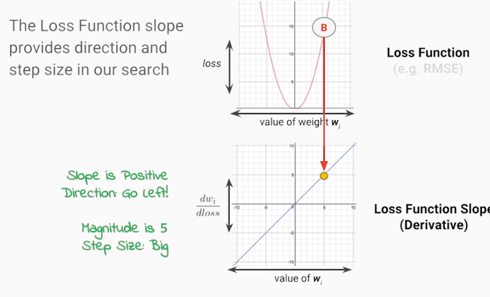

* [机器学习使用TensorFlow goolge课程](https://www.coursera.org/specializations/machine-learning-tensorflow-gcp)
    
 
    
    
## 第一 课

* 训练阶段是让模型变得智能
* model是一个函数， 参数是一系列需要调整的值，目的是让函数的输出等于实际的标签。
* simple Ml + more data > fancy ml + small data

#### 避免ML的10个大坑
1. ML requires just as much software infrastructure
2. No data collected yet
3. Assume the data is ready for use
4. Keep humans in the loop
5. Product launch focused on the ML algorithm
6. ML optimizing for the wrong thing
7. Is your ML improving things in the real world
8. Using a pre-trained ML algorithm vs building your own
9. ML algorithms are trained more than once
10. Trying to design your own perception or NLP algorithm

* 我想进一步放大关于这个讲座的最后提醒。 从无到有的机器学习解决方案是很诱人的，但这是一个冒险的举措。
 在Google以及您的组织中也可能取得成功，通常会遵循更加结构化的方法，稳步增加前期投资，
 因为随着您对用户和产品市场的更多经验和研究，业务不确定性会下降。 
 我们在这里已经讨论了很多关于这个业务流程评分反馈循环。

#### 混淆矩阵
* 混淆矩阵的意义在于，让你根据需求判断，查准率和查全率的关系，这是具体需求中很重要的衡量标准。
* 选择衡量标准来在false positive 和false negative 之间获得平衡。也就是获得 threshold

### 写代码的五个流程

* 写代码
* 运行
* 测试结果
* 写文档
* 协作与交流
* loop

## 第二门课 开始机器学习

#### 两种方法：回归和分类
* 连续的叫做回归， 根据x预测y
* 离散的叫做分类， 根据x预测类别

#### 两种数据
* 结构化的数据：适合传统的机器学习
* 非结构化的数据：深度学习，图像，音频等

#### 历史

* 线性模型
* perceptron
* neural networks
* decision trees
* kernel methods
* random forest: strong learner from many weak learners

### 优化你的模型

* 利用损失函数评估模型表现
* 使用损失函数作为梯度下降算法的偏差
* 尽可能优化梯度

#### 特征

* 讨论预测的时候首先应该确认的是特征
* 在参数空间中选取权重

#### 定义损失

* 这次参数的损失是多少
* 交叉熵：正例的预测值越大越好，反例的预测值越小越好

#### 梯度下降

* 在参数空间中寻找最优值，该点的取值能使的loss函数最小

* 朝切线（微分）反方向走。通过这样的方式，在参数空间寻找最优值。

## 需要解决的问题

### ML能做什么

* 能够学习到规则，数据之间的关系
* 组合信息，通过特征，学习数据中隐含的
* 自动学习到那些一些特征，这些特征对于拟合数据有帮助，自动训练处特征对于某数据的权值。让输出接近真实标签。

### ML不能做什么

### 为什么梯度下降