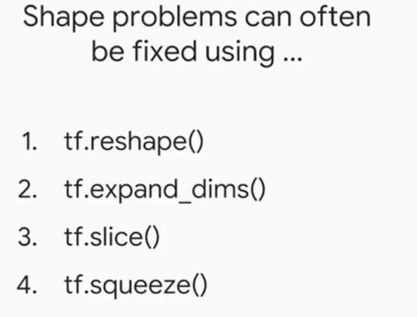
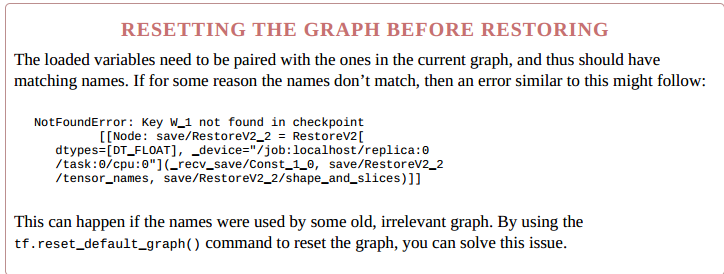
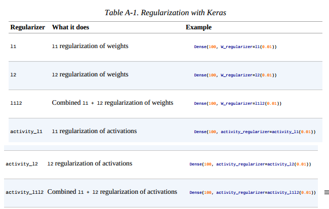

## session

* A Session object is the part of the TensorFlow API that communicates between Python objects and data on our end, 
and the actual computational system where memory is allocated for the objects we define, intermediate variables are stored,
and finally results are fetched for us.

* TensorFlow： 基于数据流图的数值计算的框架


* tensorflow 做lazy evaluation
    * write the DAG
    * run the DAG in session
* 也可以是 eager模式
```
import tensorflow as tf
from tensorflow.contrib.eager.python import tfe

tfe.enable_eager_execution()

x = tf.constant([1, 2, 3])
y = tf.constant([1, 2, 3])
print(x + y)
```
* 保存图


* 查看图


### 1. Constructing and Managing Our Graph

* tensorflow会自己构建一张图
* tf.Graph() 可以构建一张新图。
```
import tensorflow as tf
print(tf.get_default_graph())
g = tf.Graph()
print(g)
Out:
<tensorflow.python.framework.ops.Graph object at 0x7fd88c3c07d0>
<tensorflow.python.framework.ops.Graph object at 0x7fd88c3c03d0>
```

### 2. debug tensorflow

* 步骤  


* 有关shape的问题  


* datatype error  

* 总结  


* [code](study_api/study_debug.py)


### 3. Queues, Threads, and Reading

#### 3.1 TFRecords

*  A TFRecord file is simply a binary file, containing serialized input data. 
* 序列化基于protobufs，通过使用描述数据结构的模式，以纯文字的形式转换数据以进行存储，而与正在使用的平台或语言无关（很像XML）。
* Writing with TFRecordWriter
```
data_splits = ["train", "test", "validation"]
for d in range(len(data_splits)):
    print("saving " + data_splits[d])
    data_set = data_sets[d]
    filename = os.path.join(save_dir, data_splits[d] + '.tfrecords')
    writer = tf.python_io.TFRecordWriter(filename)

    for index in range(data_set.images.shape[0]):
        image = data_set.images[index].tostring()
        example = tf.train.Example(features=tf.train.Features(feature={
            'height': tf.train.Feature(int64_list=tf.train.Int64List(value=[data_set.images.shape[1]])),
            'width': tf.train.Feature(int64_list=tf.train.Int64List(value=[data_set.images.shape[2]])),
            'depth': tf.train.Feature(int64_list=tf.train.Int64List(value=[data_set.images.shape[3]])),
            'label': tf.train.Feature(int64_list=tf.train.Int64List(value=[int(data_set.labels[index])])),
            'image_raw': tf.train.Feature(bytes_list=tf.train.BytesList(value=[image]))
        }))
        writer.write(example.SerializeToString())
    writer.close()
```


#### 3.2 Queues

* 和普通的队列一样
* 队列也是图的而一部分
* 入队
```
enque_op = queue1.enqueue(["F"])
sess.run(enque_op)
```
* 出队
```
x = queue1.dequeue() # 出一个
sess.run(x)
inputs = queue1.dequeue_many(4) #出多个
```

#### 3.3 Multithreading

* 队列
```
gen_random_normal = tf.random_normal(shape=())
queue = tf.FIFOQueue(capacity=100,dtypes=[tf.float32],shapes=())
enque = queue.enqueue(gen_random_normal)

def add():
    for i in range(10):
        sess.run(enque)
```
* 申请线程
```
threads = [threading.Thread(target=add, args=()) for i in range(10)]
```
* 启动线程
```
for t in threads:
    t.start()
```


#### 3.4 tf.train.Coordinator


#### 3.5 tf.train.QueueRunner and tf.RandomShuffleQueue
 
* 我们可以使用内置的tf.train.QueueRunner， 运行多个线程管理队列.
```
gen_random_normal = tf.random_normal(shape=())
queue = tf.RandomShuffleQueue(capacity=100,dtypes=[tf.float32],cmin_after_dequeue=1)

enqueue_op = queue.enqueue(gen_random_normal)
qr = tf.train.QueueRunner(queue, [enqueue_op] * 4)
coord = tf.train.Coordinator()
enqueue_threads = qr.create_threads(sess, coord=coord, start=True)
coord.request_stop()
coord.join(enqueue_threads)
```

#### 3.6 tf.train.string_input_producer() and tf.TFRecordReader()

* tf.train.string_input_producer() 只是创建一个QueueRunner，
* tf.train.start_queue_runners() and Wrapping Up


### 4. Exporting and Serving Models with TensorFlow

* 使用numpy方式
```
import numpy as np
weights = sess.run(W)
np.savez(os.path.join(path, 'weight_storage'), weights)

loaded_w = np.load(path + 'weight_storage.npz')
loaded_w = loaded_w.items()[0][1]

sess.run(W.assign(loaded_w))
```
* 使用内置的 save类
```
saver = tf.train.Saver(max_to_keep=7, keep_checkpoint_every_n_hours=0.5)

DIR = "path/to/model"
with tf.Session() as sess:
    for step in range(1,NUM_STEPS+1):
        if step % 50 == 0:
            saver.save(sess, os.path.join(DIR, "model"), global_step=step)  # 保存模型
            
            
    saver.restore(sess, os.path.join(DIR,"model_ckpt-1000"))  # 加载模型
```
* 注意


* 到目前为止， 所有方法为了加载参数都需要重建图. Saver也提供不重建的方式通过生成 .meta 文件保存了所有的需要的信息。


* 保存变量
```
saver = tf.train.Saver(max_to_keep=7, keep_checkpoint_every_n_hours=1)
saver.export_meta_graph(os.path.join(DIR,"model_ckpt.meta"), collection_list=['train_var'])
```
* 加载变量
```
with tf.Session() as sess:
    sess.run(tf.global_variables_initializer())
    saver = tf.train.import_meta_graph(os.path.join(DIR,"model_ckpt.meta")
    saver.restore(sess, os.path.join(DIR,"model_ckpt-1000"))
    
    x = tf.get_collection('train_var')[0]
    y_true = tf.get_collection('train_var')[1]
    accuracy = tf.get_collection('train_var')[2]
```

#### 4.1 SERIALIZATION AND PROTOCOL BUFFERS

* 当我们的程序需要保存在内存中时，我们需要首先定义表示的形式，并且有效转换为这种形式，序列化使用一个函数将数据转化为字符串，
这个字符串之后可以反序列化到数据。
* 尽管在简单的数据结构实例中，这可能是微不足道的，但是在具有嵌套数组，字典和对象的复杂数据结构中，采取的方法并不那么简单。
*  JSON and XML 很好，自带分隔符。
* Protocol buffers是使用的转换数据的方式.可以使用在非压缩文本格式作为调试、编辑或者二进制格式。

### 4.2 Introduction to TensorFlow Serving


#### 4.3 正则化

* total_loss = cross_entropy + LAMBDA * tf.nn.l2_loss(W)
* 正则函数

