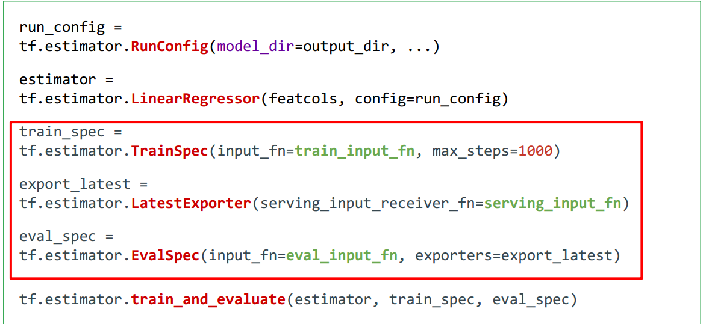
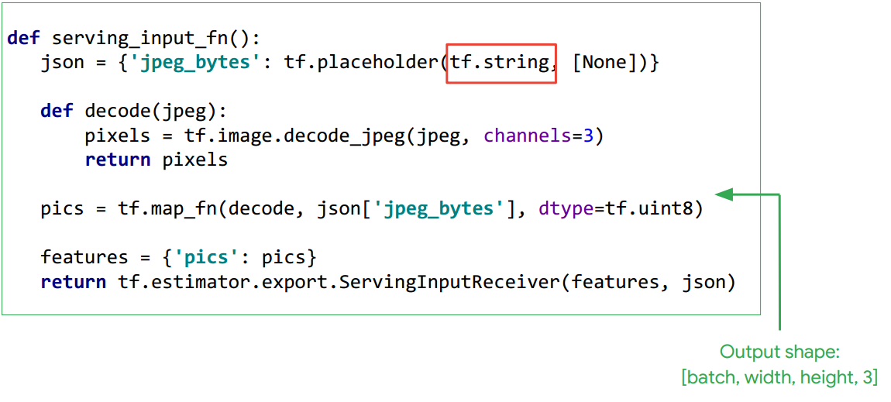
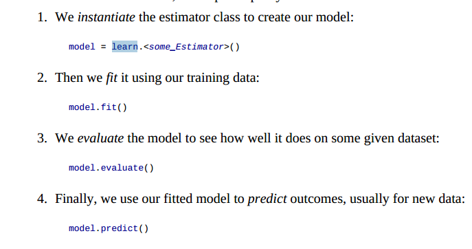

## 高层封装


### estimator

* [参考资料](03.intro_tensorflow/3.-Estimator-API.pdf)


* why
    * Create production-ready machine learning models using an API
    * Train on large datasets that do not fit in memory
    * Quickly monitor your training metrics in Tensorboard
* 体系构建


1. 读取大数据， 加载读取方式，构建图，不是真的读取


2. 数据的分布: 如何划分数据，数据的使用方式


3. 可视化


4. 发布



    
* 总结


* [code](study_api/study_estimator.py)


### contrib.learn

* 引入
```
import tensorflow as tf
from tensorflow.contrib import learn
```
* 函数


* 调用四步




### Pretrained models with TF-Slim

* 函数


* 导入
```
from tensorflow.contrib import slim
```

#### Downloading and using a pretrained model

* 下载模型


* 准备数据


* 使用你的模型


